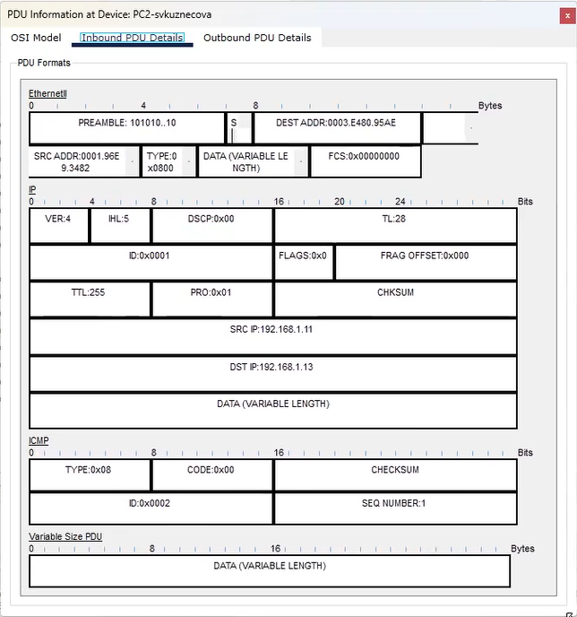

---
## Front matter
lang: ru-RU
title: Лабораторная работы №1
subtitle: Знакомство с Cisco PacketTracer
author:
  - Кузнецова С. В.
institute:
  - Российский университет дружбы народов, Москва, Россия
date: 14 февраля 2025

## i18n babel
babel-lang: russian
babel-otherlangs: english

## Formatting pdf
toc: false
toc-title: Содержание
slide_level: 2
aspectratio: 169
section-titles: true
theme: metropolis
header-includes:
 - \metroset{progressbar=frametitle,sectionpage=progressbar,numbering=fraction}
 - '\makeatletter'
 - '\beamer@ignorenonframefalse'
 - '\makeatother'
---

# Информация

## Докладчик

:::::::::::::: {.columns align=center}
::: {.column width="70%"}

  * Кузнецова София Вадимовна
  * Российский университет дружбы народов

:::
::: {.column width="30%"}

:::
::::::::::::::

# Ход работы

## Создание нового проекта lab_PT-01.pkt

{ #fig:001 width=35% }

## Концентратор (Hub-PT-svkuznecova) и четыре оконечных устройства PC-svkuznecova

{ #fig:002 width=20% }

{ #fig:003 width=20% }

## <<Add Simple PDU (P)>>

{ #fig:004 width=25% }

{ #fig:005 width=25% }

{ #fig:006 width=20% }

## <<Add Simple PDU (P)>>

{ #fig:007 width=20% }

{ #fig:008 width=20% }

## Challenge Me

{ #fig:009 width=50% }

## Пакет ICMP
	
{ #fig:010 width=35% }

## PDU
{ #fig:011 width=10% }

{ #fig:012 width=10% }

{ #fig:013 width=10% }

## Коммутатор и 4 оконечных устройства PC

{ #fig:014 width=15% }

{ #fig:015 width=15% }

## Два пакета и два события

{ #fig:016 width=25% }

{ #fig:017 width=25% }

## PC4-> PC6. PC6 -> PC4

{ #fig:018 width=50% }

## Кроссовый кабель концентратора и коммутатора

{ #fig:019 width=30% }

{ #fig:020 width=30% }

## STP

{ #fig:021 width=50% }

## Маршрутизатора Cisco 2811

{ #fig:022 width=20% }

{ #fig:023 width=20% }

## CDP
    	   	
{ #fig:024 width=30% }
	
{ #fig:025 width=30% }

# Выводы

В ходе выполнения лабораторной работы были приобретены практические навыки установки инструмента моделирования конфигурации сети Cisco Packet Tracer [3], знакомство с его интерфейсом.

## {.standout}

Спасибо за внимание!

