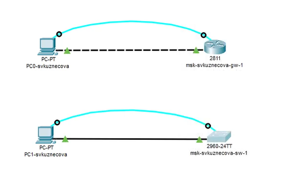
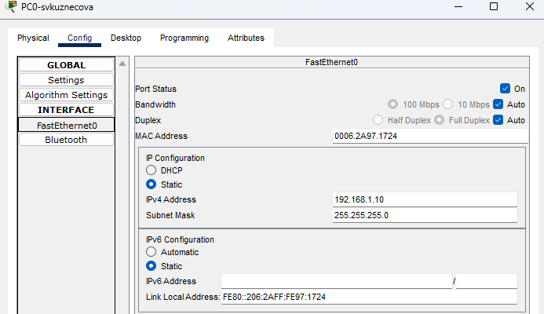
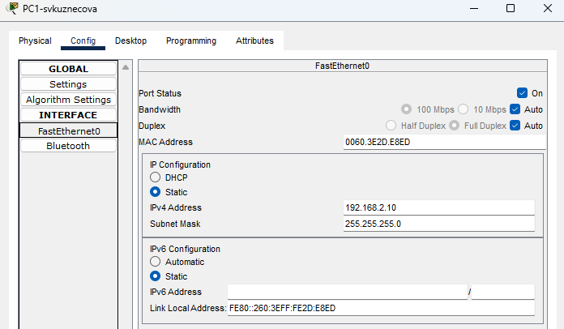
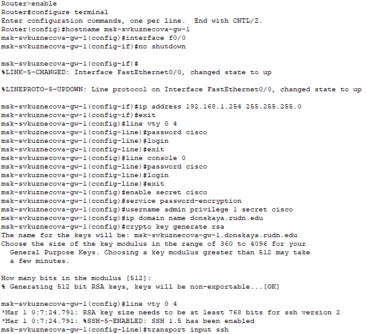
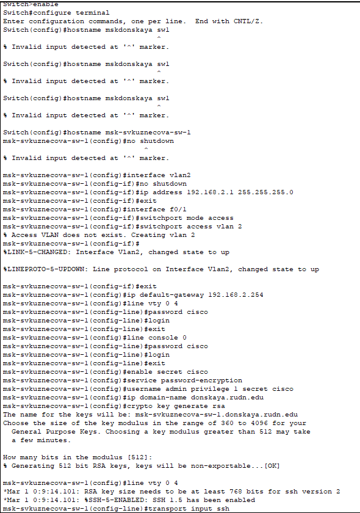
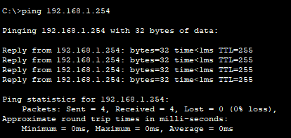
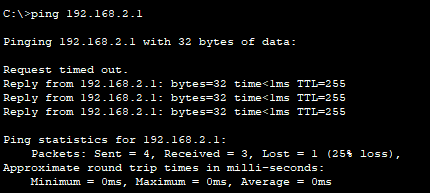
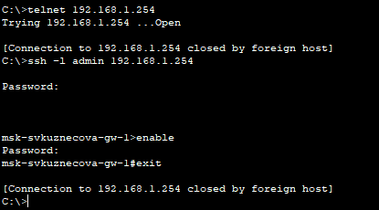
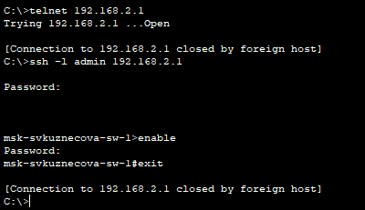

---
## Front matter
lang: ru-RU
title: Лабораторная работы №2
subtitle: Предварительная настройка оборудования Cisco
author:
  - Кузнецова С. В.
institute:
  - Российский университет дружбы народов, Москва, Россия
date: 17 февраля 2025

## i18n babel
babel-lang: russian
babel-otherlangs: english

## Formatting pdf
toc: false
toc-title: Содержание
slide_level: 2
aspectratio: 169
section-titles: true
theme: metropolis
header-includes:
 - \metroset{progressbar=frametitle,sectionpage=progressbar,numbering=fraction}
 - '\makeatletter'
 - '\beamer@ignorenonframefalse'
 - '\makeatother'
---

# Информация

## Докладчик

:::::::::::::: {.columns align=center}
::: {.column width="70%"}

  * Кузнецова София Вадимовна
  * Российский университет дружбы народов

:::
::: {.column width="30%"}

:::
::::::::::::::

# Ход работы

## Создание нового проекта lab_PT-02.pkt

{ #fig:001 width=70% }

## Коммутатор, маршрутизатор и 2 оконечных устройства

{ #fig:002 width=60% }

## Статические IP-адреса с маско подсети:

{ #fig:003 width=30% }

{ #fig:004 width=30% }

## Настройка маршрутизатора.

{ #fig:005 width=50% }

## Настройка коммутатора.

{ #fig:006 width=30% }

## Работоспособность соединений с помощью команды ping.

{ #fig:007 width=30% }

{ #fig:008 width=30% }

## Подключение к коммутатору и маршрутизатору разными способами: с помощью консольного кабеля, по протоколу удалённого доступа (telnet, ssh).

{ #fig:009 width=25% }

{ #fig:010 width=25% }

# Выводы

В ходе выполнения лабораторной работы были приобретены практические навыки по начальному конфигурированию оборудования Cisco.

## {.standout}

Спасибо за внимание!

