---
## Front matter
lang: ru-RU
title: Лабораторная работы №3
subtitle: Планирование локальной сети организации
author:
- Кузнецова С. В.
institute:
  - Российский университет дружбы народов, Москва, Россия
date: 28 февраля 2025

## i18n babel
babel-lang: russian
babel-otherlangs: english

## Formatting pdf
toc: false
toc-title: Содержание
slide_level: 2
aspectratio: 169
section-titles: true
theme: metropolis
header-includes:
 - \metroset{progressbar=frametitle,sectionpage=progressbar,numbering=fraction}
---

# Информация

## Докладчик

:::::::::::::: {.columns align=center}
::: {.column width="70%"}

  * Кузнецова София Вадимовна
  * Российский университет дружбы народов

:::
::: {.column width="30%"}

:::
::::::::::::::

# Ход работы

## Схема L1 (сеть 10.128.0.0.24)

{#fig:001 width=60%}

## Схема L2 (сеть 10.128.0.0.24)

{#fig:002 width=60%}

## Схема L3 (сеть 10.128.0.0.24)

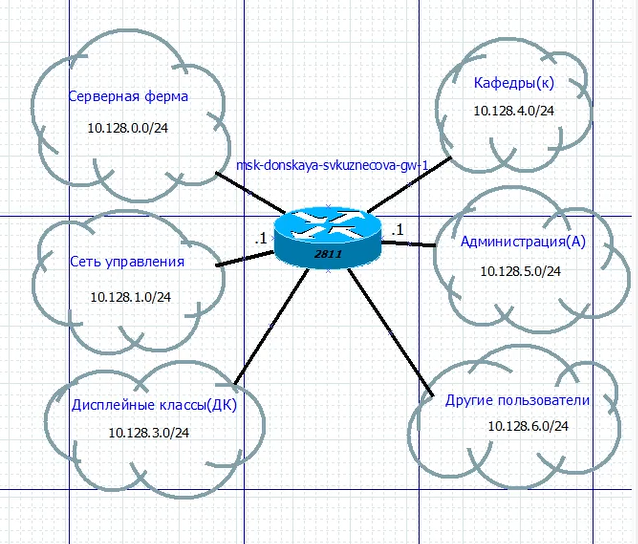{#fig:003 width=50%}

## Таблица VLAN (сеть 10.128.0.0.24)

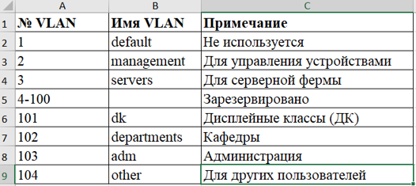{#fig:004 width=70%}

## Таблица IP (сеть 10.128.0.0.24)

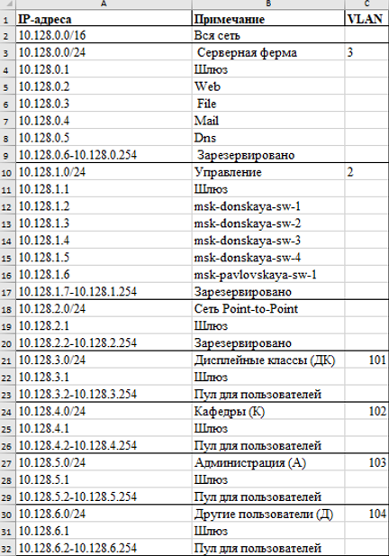{#fig:005 width=25%}

## Таблица портов (сеть 10.128.0.0.24)

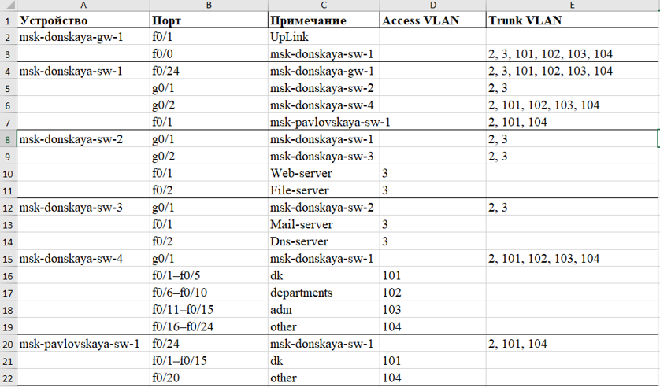{#fig:006 width=60%}

## Схема L1 (сеть 172.16.0.0/12)

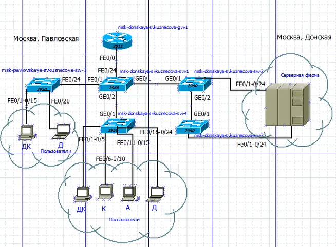{#fig:007 width=60%}

## Схема L2 (сеть 172.16.0.0/12)

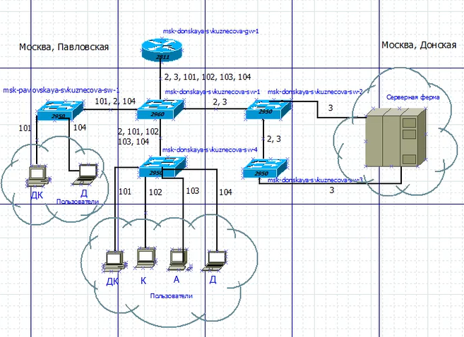{#fig:008 width=60%}

## Схема L3 (сеть 172.16.0.0/12)

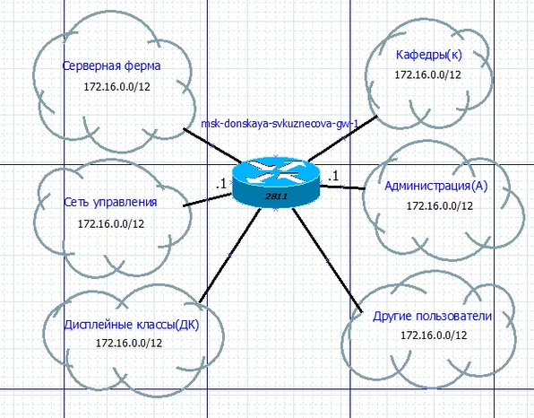{#fig:009 width=60%}

## Таблица VLAN (сеть 172.16.0.0/12)

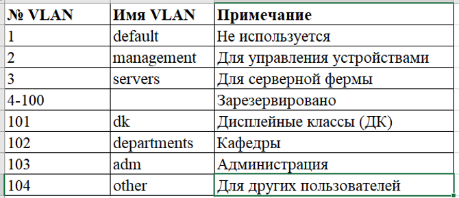{#fig:010 width=70%}

## Таблица IP (сеть 172.16.0.0/12)

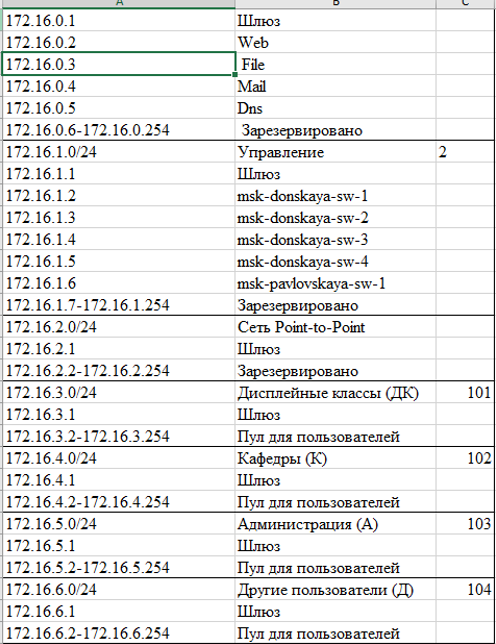{#fig:011 width=25%}

## Таблица портов (сеть 172.16.0.0/12)

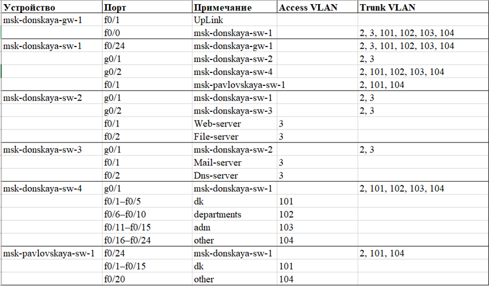{#fig:012 width=60%}

## Схема L1 (сеть 192.168.0.0/16)

{#fig:013 width=60%}

## Схема L2 (сеть 192.168.0.0/16)

{#fig:014 width=60%}

## Схема L3 (сеть 192.168.0.0/16)

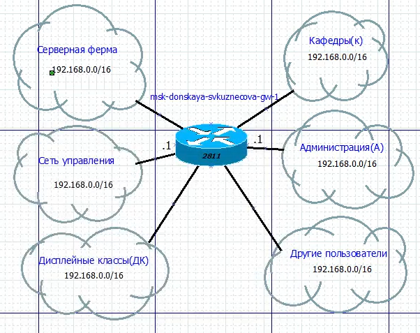{#fig:015 width=60%}

## Таблица VLAN (сеть 192.168.0.0/16)

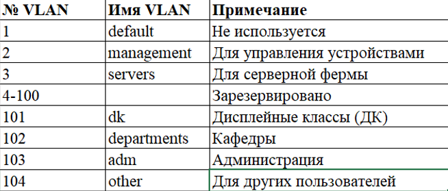{#fig:016 width=70%}

## Таблица IP (сеть 192.168.0.0/16)

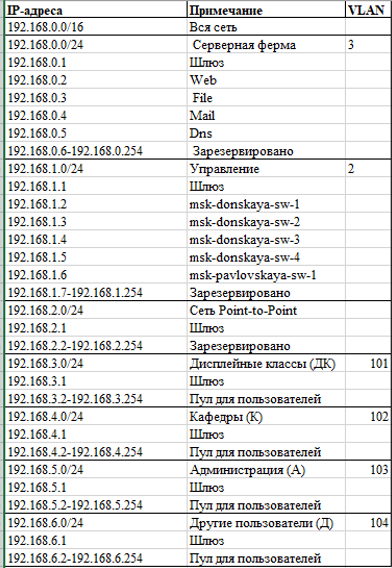{#fig:017 width=25%}

## Таблица портов (сеть 192.168.0.0/16)

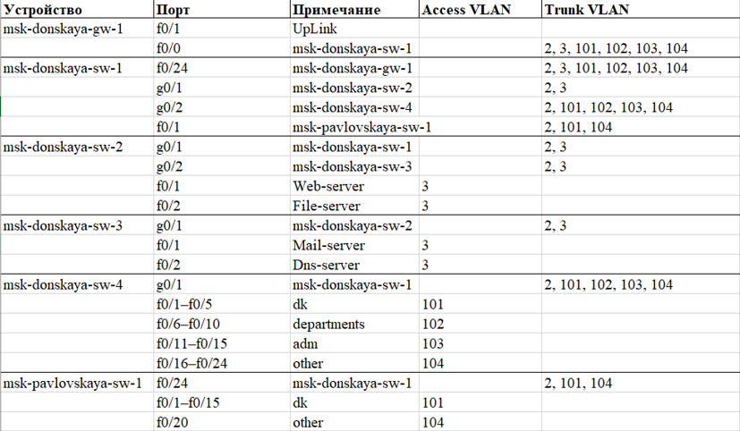{#fig:018 width=60%}

## {.standout}

Спасибо за внимание!

