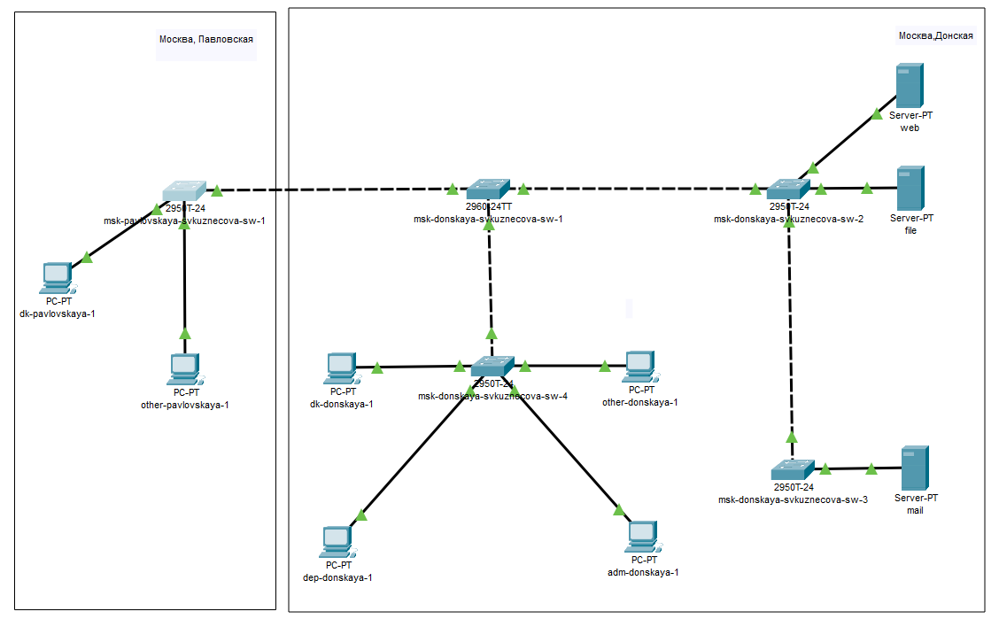
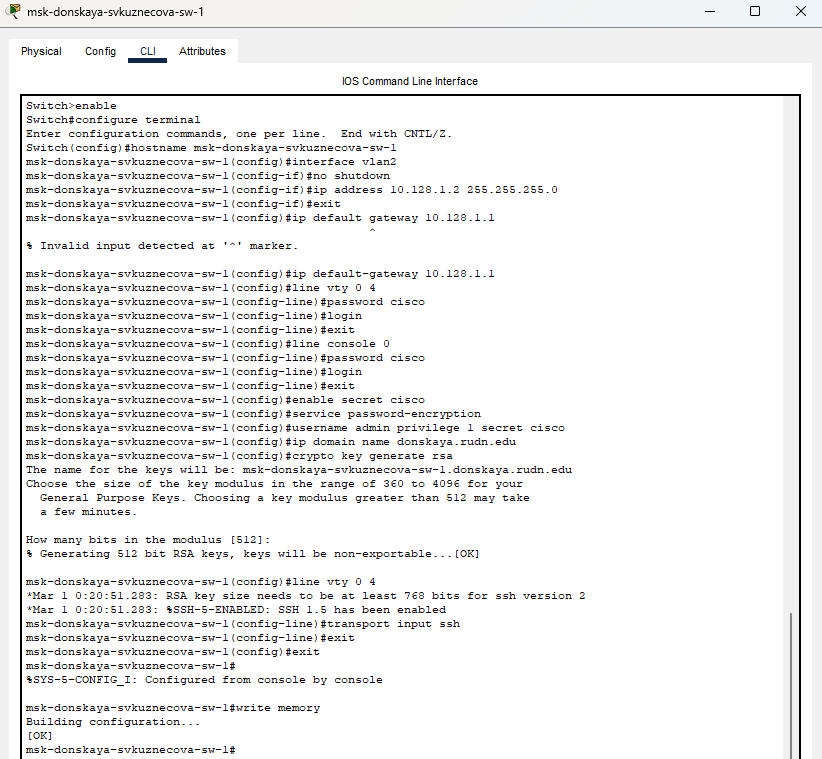
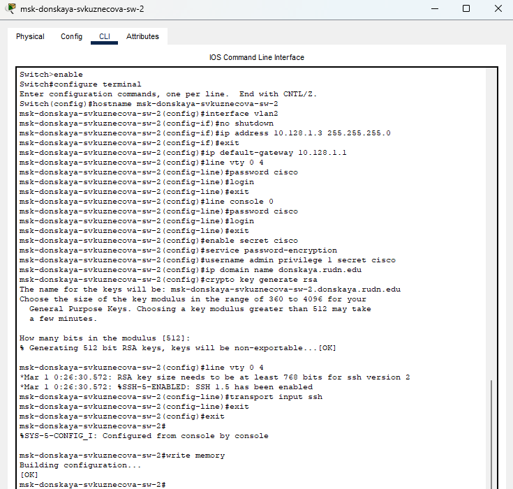
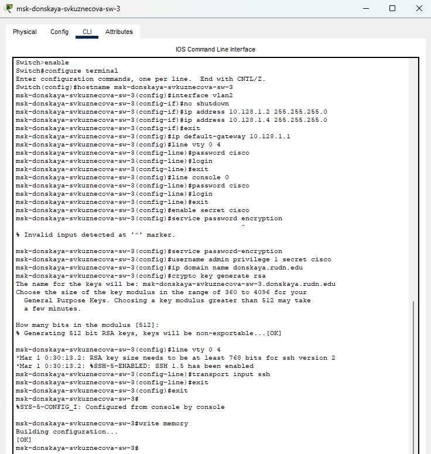
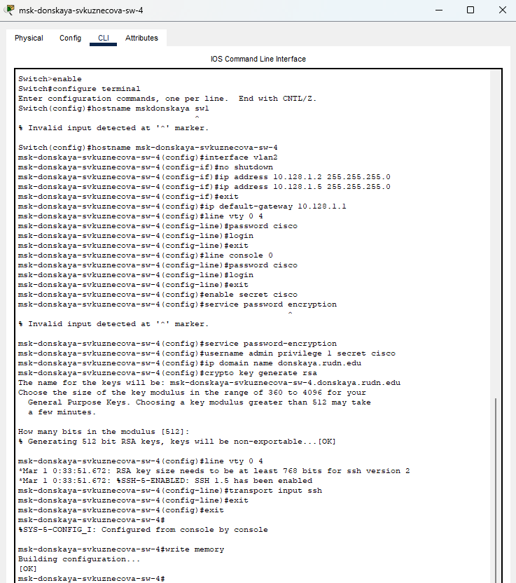
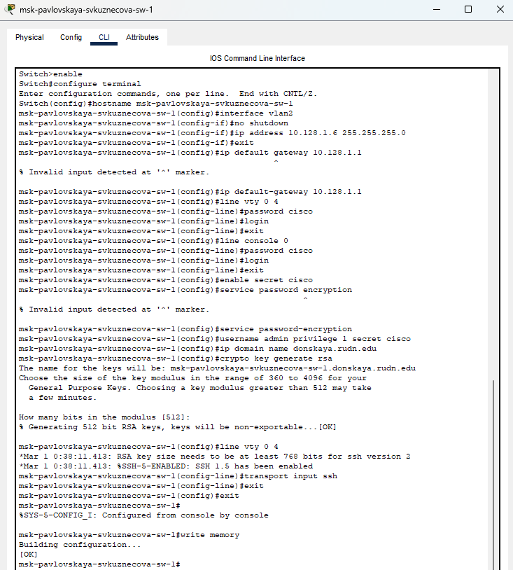

---
## Front matter
lang: ru-RU
title: лабораторная работа №4
subtitle: Первоначальное конфигурирование сети
author:
  - Кузнецова С. В.
institute:
  - Российский университет дружбы народов, Москва, Россия
date: 03 марта 2025

## i18n babel
babel-lang: russian
babel-otherlangs: english

## Formatting pdf
toc: false
toc-title: Содержание
slide_level: 2
aspectratio: 169
section-titles: true
theme: metropolis
header-includes:
 - \metroset{progressbar=frametitle,sectionpage=progressbar,numbering=fraction}
---

# Информация

## Докладчик

:::::::::::::: {.columns align=center}
::: {.column width="70%"}

  * Кузнецова София Вадимовна
  * Российский университет дружбы народов

:::
::: {.column width="30%"}

:::
::::::::::::::

# Ход работы

## Создание проекта

{#fig:001 width=80%}

## Построение схемы

{#fig:002 width=60%}

## Настройка коммутатора

{#fig:003 width=30%}

## Настройка коммутатора

{#fig:004 width=30%}

## Настройка коммутатора

{#fig:005 width=30%}

## Настройка коммутатора

{#fig:006 width=30%}

## Настройка коммутатора

{#fig:007 width=30%}

# Выводы

В ходе выполнения лабораторной работы была проведена подготовительная работа по первоначальной настройке коммутаторов сети.

## {.standout}

Спасибо за внимание!

