---
## Front matter
lang: ru-RU
title: Лабораторная работа №5
subtitle: Конфигурирование VLAN
author:
  - Кузнецова С. В.
institute:
  - Российский университет дружбы народов, Москва, Россия
date: 12 марта 2025

## i18n babel
babel-lang: russian
babel-otherlangs: english

## Formatting pdf
toc: false
toc-title: Содержание
slide_level: 2
aspectratio: 169
section-titles: true
theme: metropolis
header-includes:
 - \metroset{progressbar=frametitle,sectionpage=progressbar,numbering=fraction}
---

# Информация

## Докладчик

  * Кузнецова София Вадимона
  * Российский университет дружбы народов

# Ход работы

## Новый проект lab_PT-05.pkt

{#fig:001 width=70%}

## Настройка Trunk-порта.

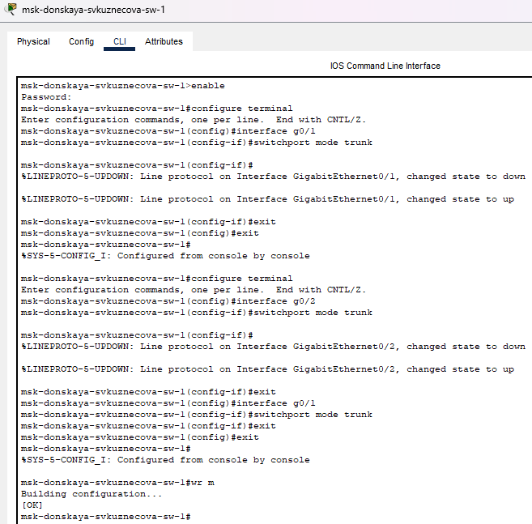{#fig:002 width=40%}

## Настройка Trunk-порта.

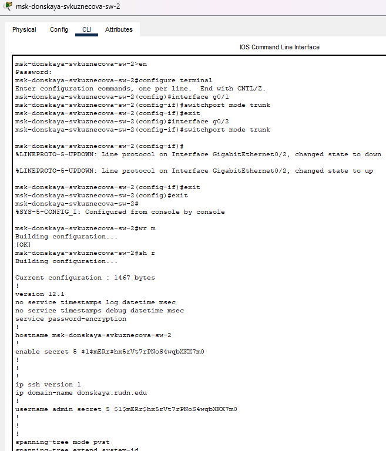{#fig:003 width=30%}

## Настройка Trunk-порта.

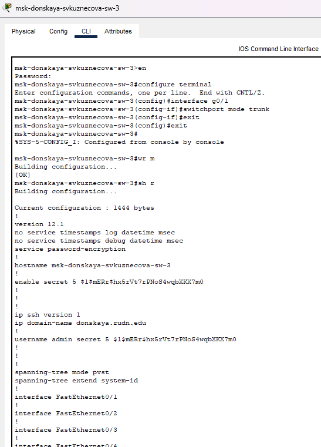{#fig:004 width=30%}

## Настройка Trunk-порта.

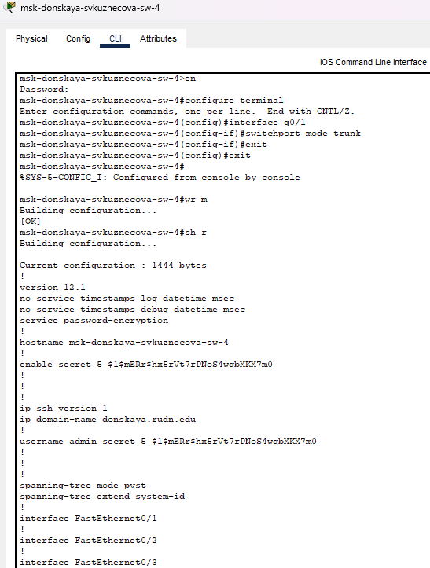{#fig:005 width=30%}

## Настройка Trunk-порта.

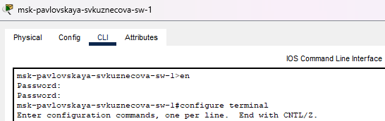{#fig:006 width=30%}

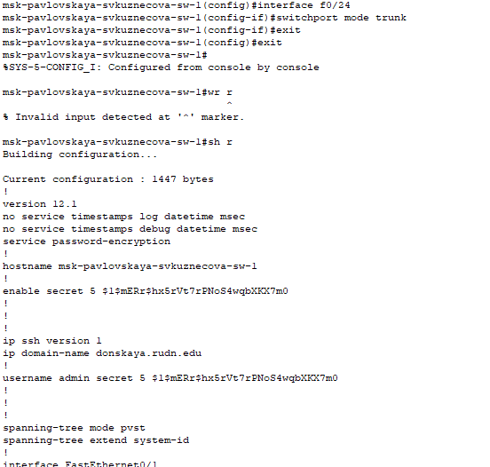{#fig:007 width=30%}

## Настройка коммутатора как VTP-сервер и пропишем на нём номера и названия

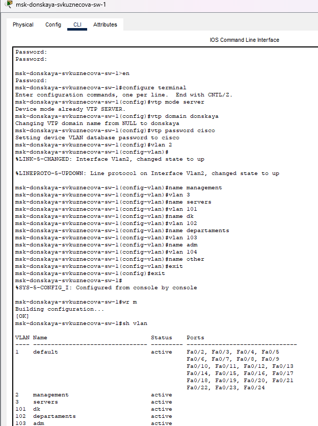{#fig:008 width=30%}

## Настройка коммутатора как VTP-клиенты и указание принадлежности к VLAN

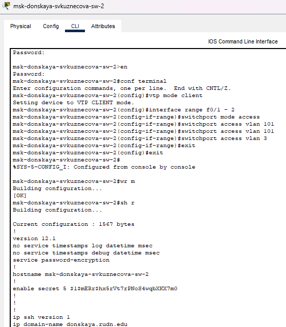{#fig:009 width=40%}

## Настройка коммутатора как VTP-клиенты и указание принадлежности к VLAN

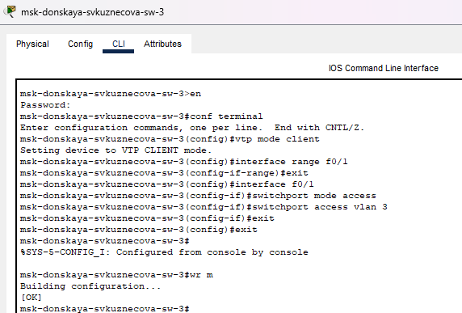{#fig:010 width=40%}

## Настройка коммутатора как VTP-клиенты и указание принадлежности к VLAN

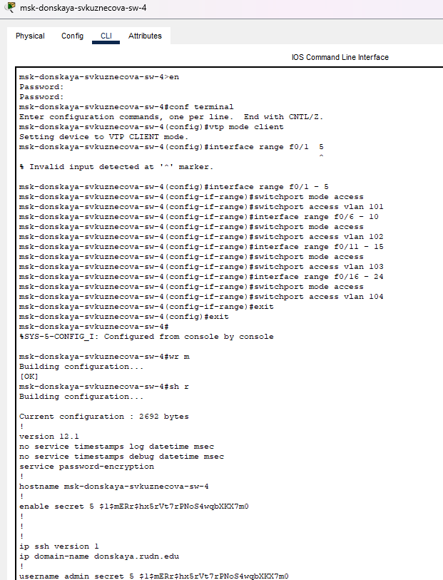{#fig:011 width=30%}

## Настройка коммутатора как VTP-клиенты и указание принадлежности к VLAN

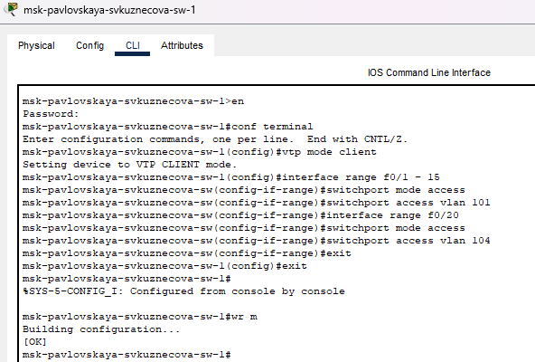{#fig:012 width=60%}

## Cтатический IP-адрес на оконечных устройствах

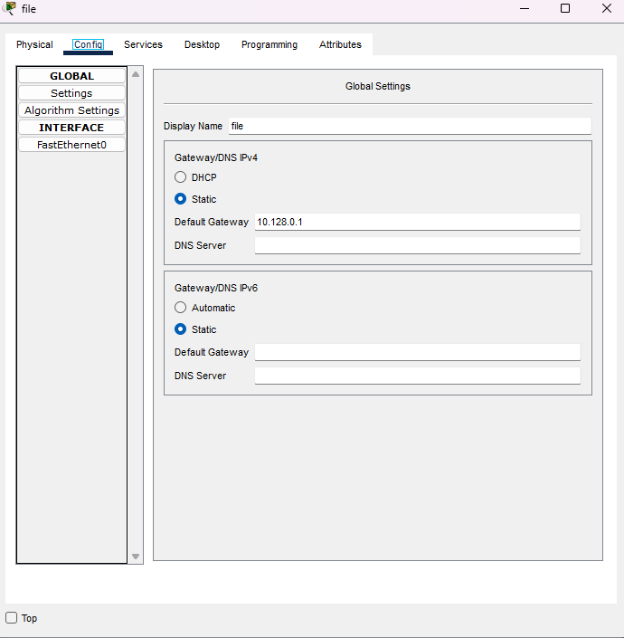{#fig:013 width=40%}

## Cтатический IP-адрес на оконечных устройствах

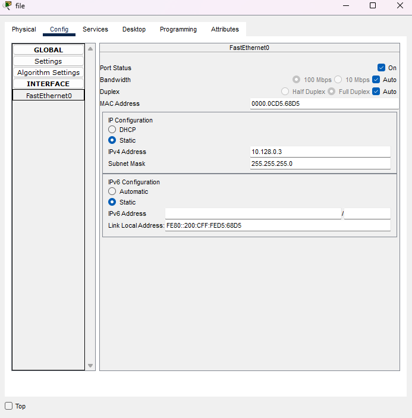{#fig:014 width=40%}

## Команда ping 

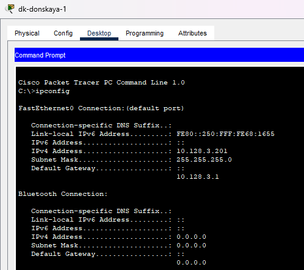{#fig:015 width=40%}

## Команда ping 

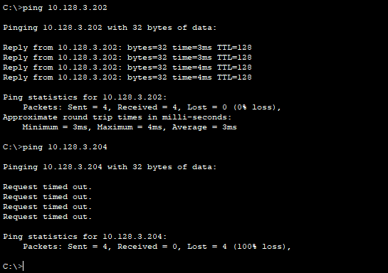{#fig:016 width=40%}

## Режим симуляции в Packet Tracer

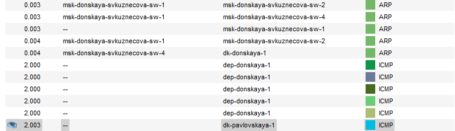{#fig:017 width=60%}

## Вывод

При выполнении лабораторной работы были получены основные навыки по настройке VLAN на коммутаторах сети.

## {.standout}

Спасибо за внимание!
