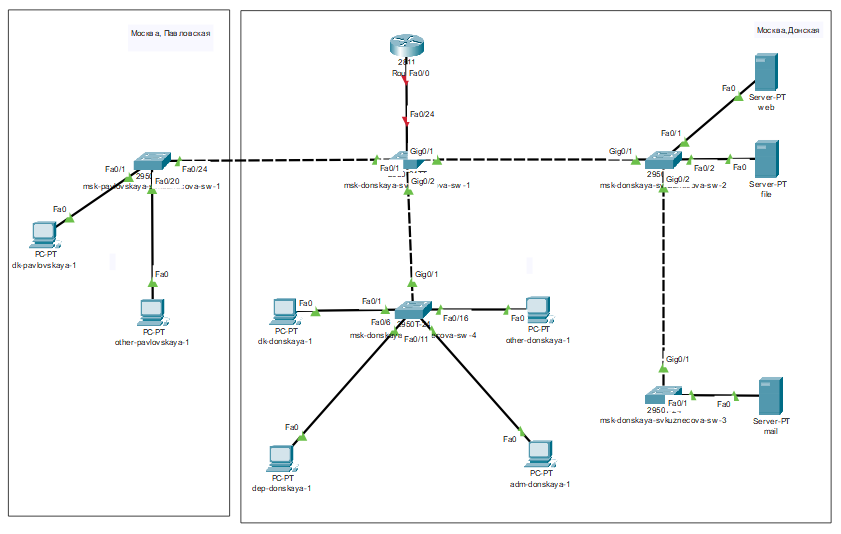
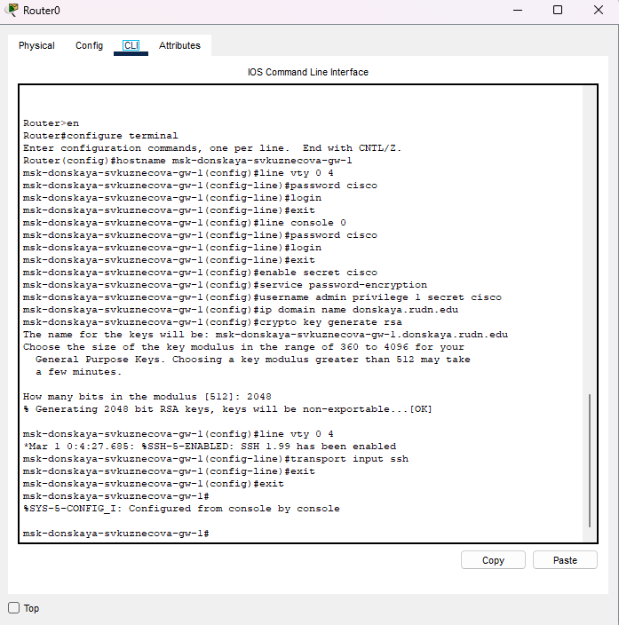
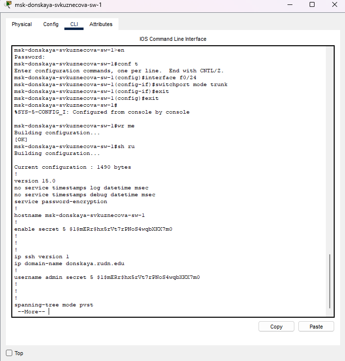
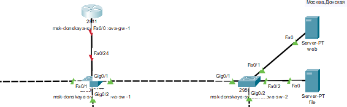
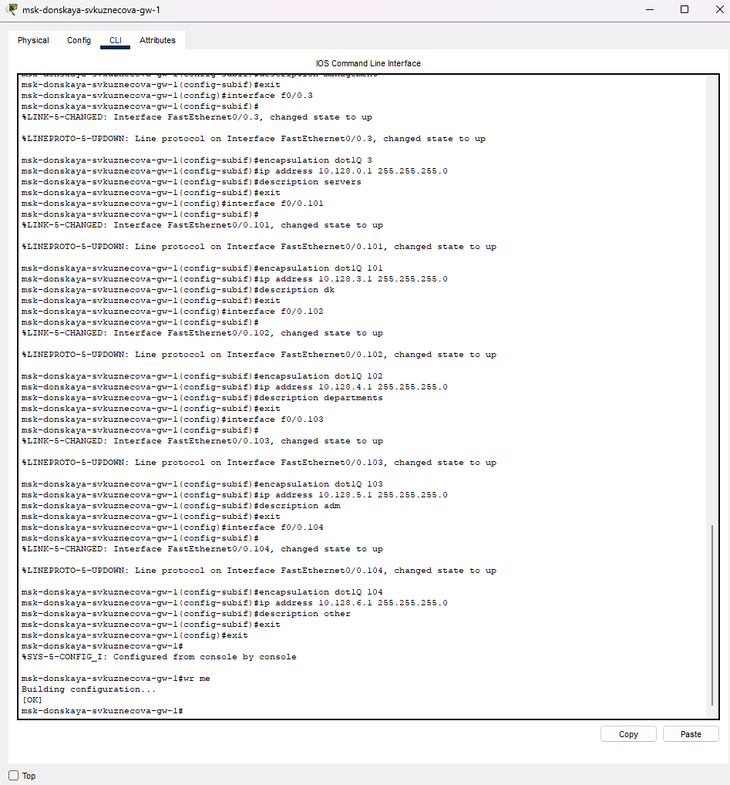
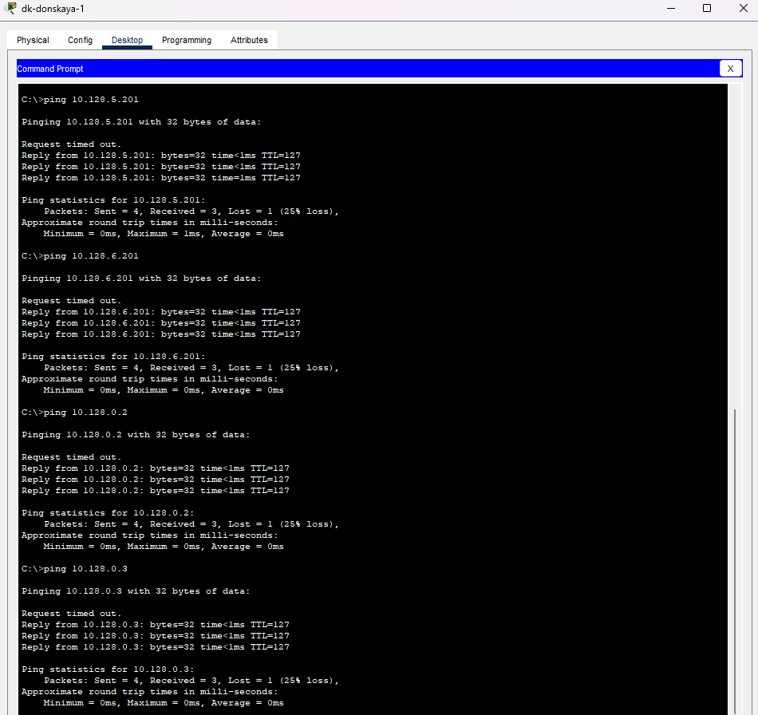
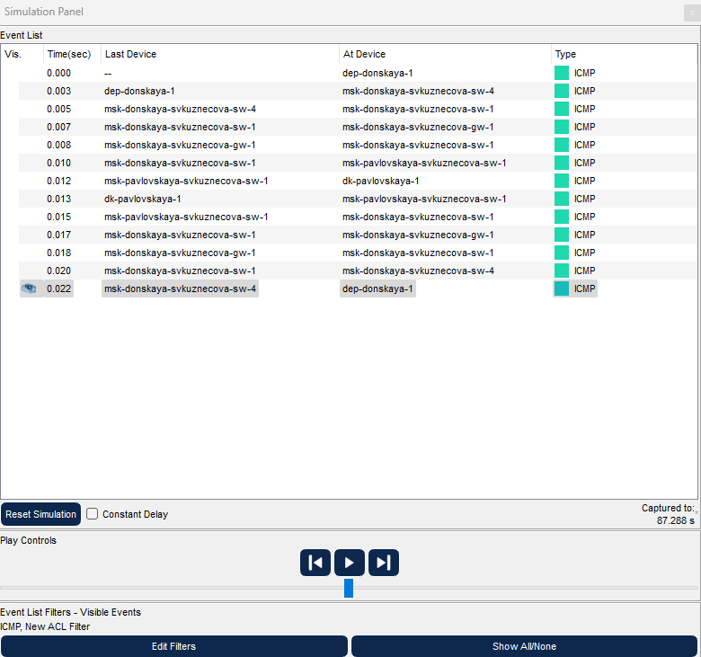

---
## Front matter
lang: ru-RU
title: лабораторная работа №6
subtitle: Статическая маршрутизация VLAN
author:
  - Кузнецова С. В.
institute:
  - Российский университет дружбы народов, Москва, Россия
date: 19 марта 2025

## i18n babel
babel-lang: russian
babel-otherlangs: english

## Formatting pdf
toc: false
toc-title: Содержание
slide_level: 2
aspectratio: 169
section-titles: true
theme: metropolis
header-includes:
 - \metroset{progressbar=frametitle,sectionpage=progressbar,numbering=fraction}
---

# Информация

## Докладчик

  * Кузнецова София Вадимовна
  * Российский университет дружбы народов
  
## Цель работы

Настроить статическую маршрутизацию VLAN в сети.

# Ход работы

## Создание проекта

{#fig:001 width=80%}

## Размещение маршрутизатора Cisco 2811 и подключение его к порту 24 коммутатора msk-donskaya-svkuznecova-sw-1

{#fig:002 width=55%}

## Конфигурирование маршрутизатора

{#fig:003 width=35%}

## Настройка порта 24 коммутатора msk-donskaya-svkuznecova-sw-1

{#fig:004 width=35%}

## Наименование маршрутизатора Cisco 2811

{#fig:005 width=70%}

## Настройка виртуальных интерфейсов

{#fig:006 width=35%}

## Доступность оконечных устройств 

{#fig:007 width=35%}

## Режим симуляции

{#fig:008 width=40%}

# Выводы

В ходе выполнения лабораторной работы научилась настраивать статическую маршрутизацию VLAN в сети.

## {.standout}

Спасибо за внимание!
