---
## Front matter
lang: ru-RU
title: Лабораторная работы №7
subtitle: Учёт физических параметров сети
author:
  - Кузнецова С. В.
institute:
  - Российский университет дружбы народов, Москва, Россия
date: 27 марта 2025

## i18n babel
babel-lang: russian
babel-otherlangs: english

## Formatting pdf
toc: false
toc-title: Содержание
slide_level: 2
aspectratio: 169
section-titles: true
theme: metropolis
header-includes:
 - \metroset{progressbar=frametitle,sectionpage=progressbar,numbering=fraction}
 - '\makeatletter'
 - '\beamer@ignorenonframefalse'
 - '\makeatother'
---

# Информация

## Докладчик

:::::::::::::: {.columns align=center}
::: {.column width="70%"}

  * Кузнецова София Вадимовна
  * Российский университет дружбы народов

:::
::: {.column width="30%"}

:::
::::::::::::::

# Ход работы

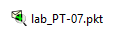{#fig:001 width=80%}

## Физическая рабочая область Packet Tracer. Город — Moscow

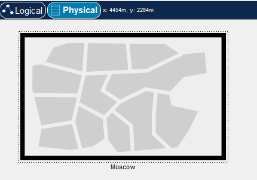{#fig:002 width=60%}

## Здание Donskaya. Здание Pavlovskaya

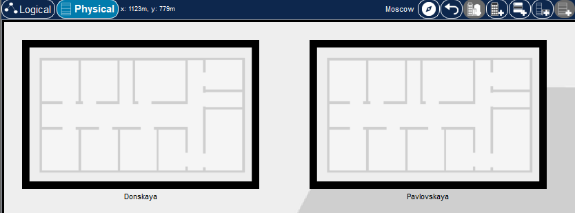{#fig:003 width=80%}

## Серверное помещение

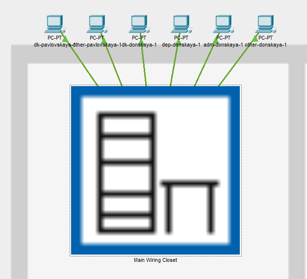{#fig:004 width=50%}

## Серверные стойки. Перенос коммутатора и двух оконечных устройства на территорию Pavlovskaya

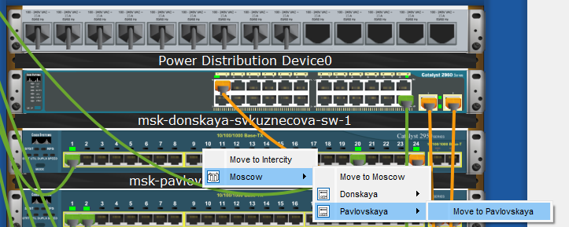{#fig:005 width=40%}

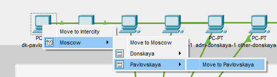{#fig:006 width=40%}

## Проверка работоспособности соединения

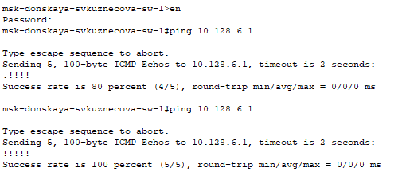{#fig:007 width=70%}

## Enable Cable Length Effects

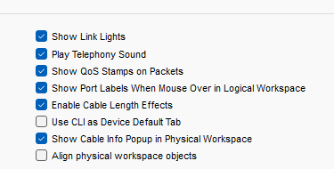{#fig:008 width=70%}

## Размещение двух территорий на расстоянии более 100 м друг от друга

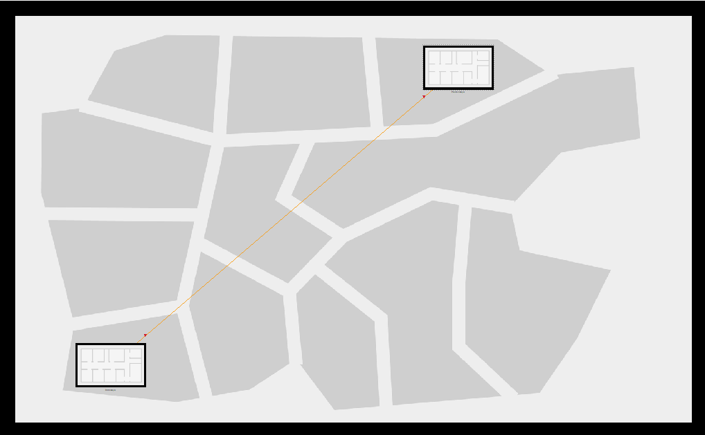{#fig:009 width=70%}

## Проверка неработоспособности соединения

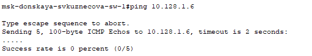{#fig:010 width=80%}

## Добавление двух повторителей (Repeater-PT). Замена имеющихся модулей на PT-REPEATER- NM-1FFE и PT-REPEATER-NM-1CFE

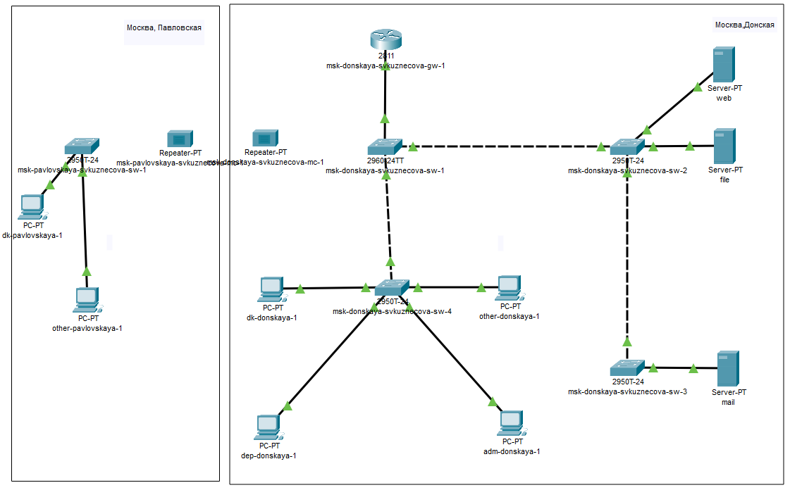{#fig:011 width=30%}

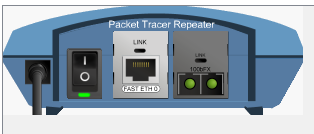{#fig:012 width=40%}

## Перенос msk-pavlovskaya-svkuznecova-mc-1 на территорию Pavlovskaya

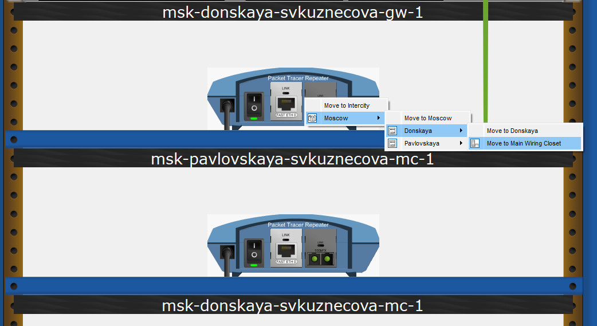{#fig:013 width=70%}

## Подключение коммутаторов 

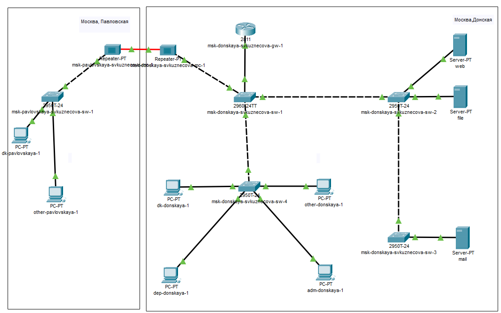{#fig:014 width=70%}

## Проверка работоспособности соединения

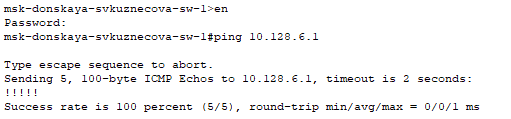{#fig:015 width=80%}

# Выводы

В ходе выполнения лабораторной работы мы получили навыки работы с физической рабочей областью Packet Tracer, а также научились учитывать физические параметры сети.

## {.standout}

Спасибо за внимание!

