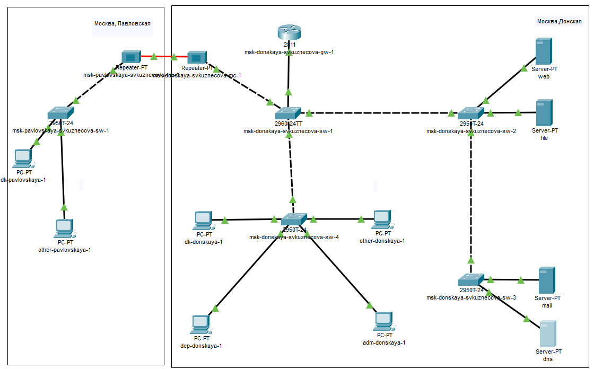
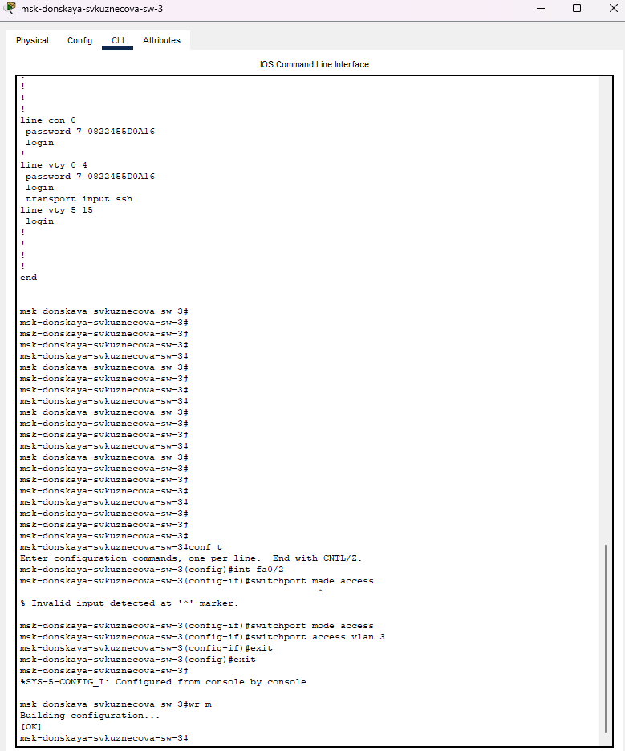
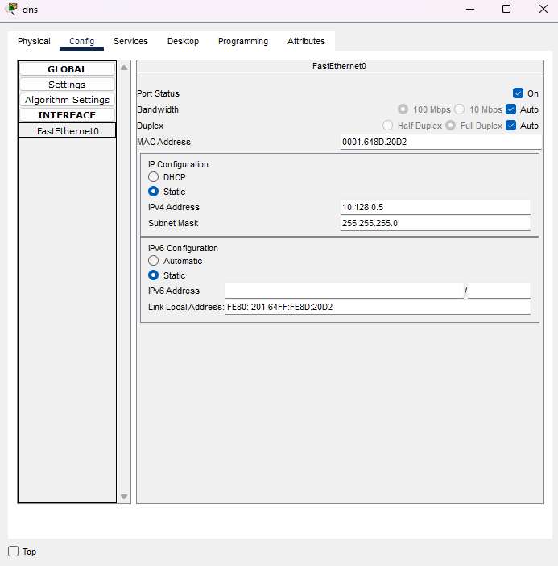
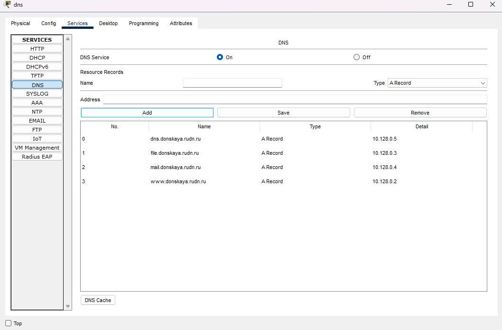
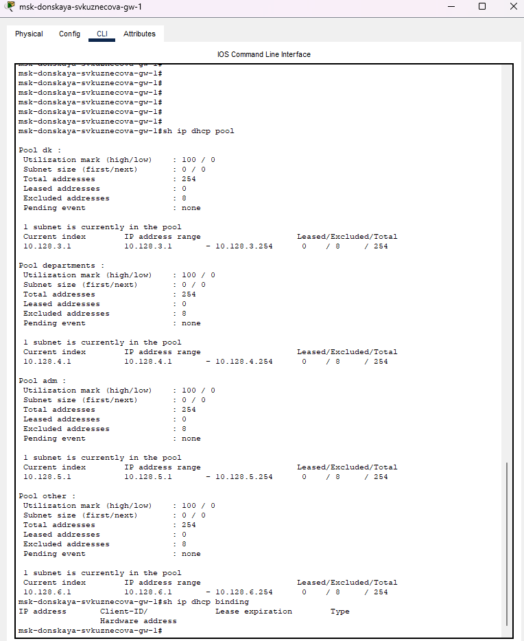
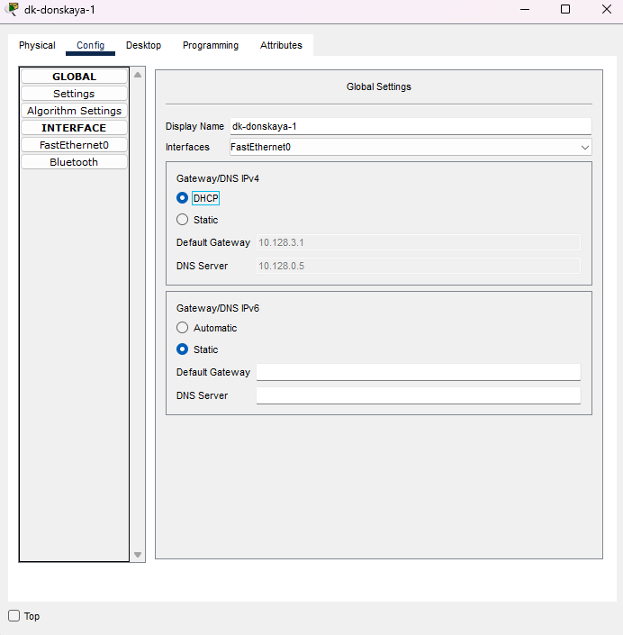
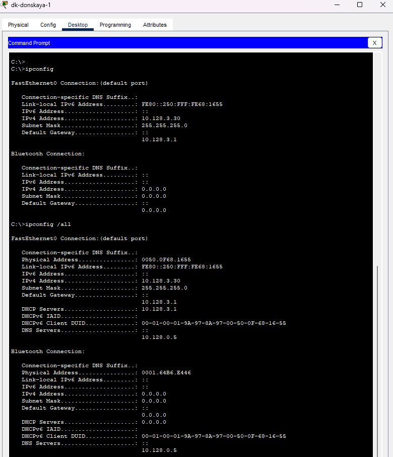
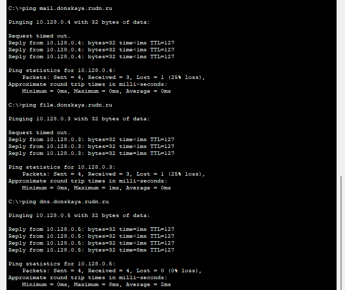
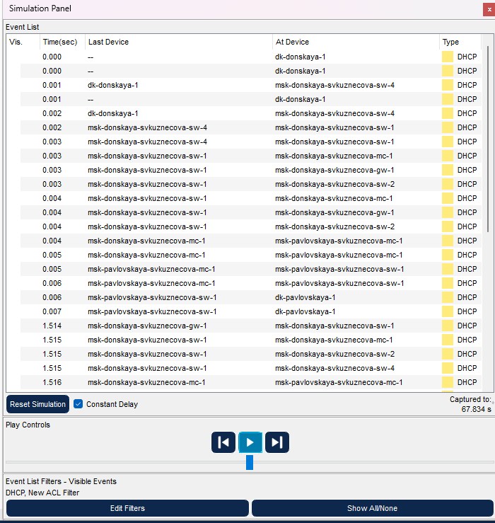

---
## Front matter
lang: ru-RU
title: Лабораторная работы №8
subtitle: Настройка сетевых сервисов. DHCP
author:
  - Кузнецова С. В.
institute:
  - Российский университет дружбы народов, Москва, Россия
date: 29 марта 2025

## i18n babel
babel-lang: russian
babel-otherlangs: english

## Formatting pdf
toc: false
toc-title: Содержание
slide_level: 2
aspectratio: 169
section-titles: true
theme: metropolis
header-includes:
 - \metroset{progressbar=frametitle,sectionpage=progressbar,numbering=fraction}
 - '\makeatletter'
 - '\beamer@ignorenonframefalse'
 - '\makeatother'
---

# Информация

## Докладчик

:::::::::::::: {.columns align=center}
::: {.column width="70%"}

  * Кузнецова София Вадимовна
  * Российский университет дружбы народов

:::
::: {.column width="30%"}

:::
::::::::::::::

# Ход работы

## Создание нового проекта lab_PT-08.pkt

{ #fig:001 width=80% }

## Добавление сервера dns

{#fig:002 width=70%}

## Активация порта

{#fig:003 width=35%}

## Настройка конфигурации сервера

{#fig:004 width=45%}

## Настройка сервиса DNS

{#fig:005 width=70%}

## Настроим DHCP-сервис на маршрутизаторе

{#fig:006 width=35%}

## На оконечных устройствах замена настройки статическое распределение адресов на динамическое.

{#fig:007 width=35%}

## Проверка, какие адреса выделяются оконечным устройствам

{#fig:008 width=40%}

## Проверка доступности устройств из разных подсетей

{#fig:009 width=40%}

## Запрос адреса по протоколу DHCP

{#fig:010 width=40%}

# Выводы

В ходе выполнения лабораторной работы мы приобрели практические навыки по настройке динамического распределения IP адресов посредством протокола DHCP (Dynamic Host Configuration Protocol) в локальной сети.

## {.standout}

Спасибо за внимание!

