---
## Front matter
lang: ru-RU
title: Лабораторная работы №10
subtitle: Настройка списков управления доступом (ACL)
author:
  - Кузнецова С. В.
institute:
  - Российский университет дружбы народов, Москва, Россия
date: 18 апреля 2025

## i18n babel
babel-lang: russian
babel-otherlangs: english

## Formatting pdf
toc: false
toc-title: Содержание
slide_level: 2
aspectratio: 169
section-titles: true
theme: metropolis
header-includes:
 - \metroset{progressbar=frametitle,sectionpage=progressbar,numbering=fraction}
---

# Информация

## Докладчик

:::::::::::::: {.columns align=center}
::: {.column width="70%"}

  * Кузнецова София Вадимовна
  * Российский университет дружбы народов

:::
::: {.column width="30%"}

:::
::::::::::::::

# Ход работы

## Создание нового проекта lab_PT-10.pkt

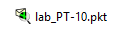{ #fig:001 width=80% }

## Ноутбук администратора с именем admin к сети к other-donskaya-1 

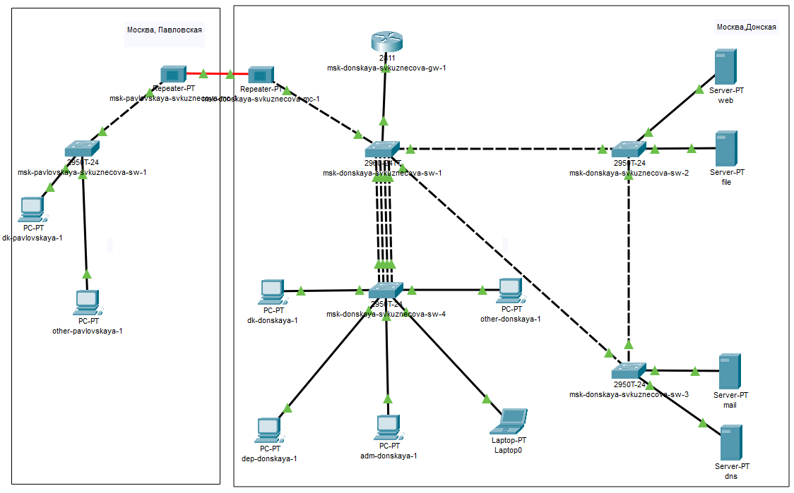{#fig:002 width=70%}

## Ноутбук администратора

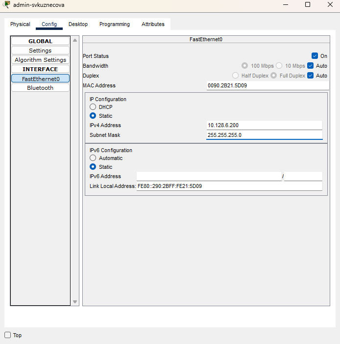{#fig:003 width=40%}

## Пинг

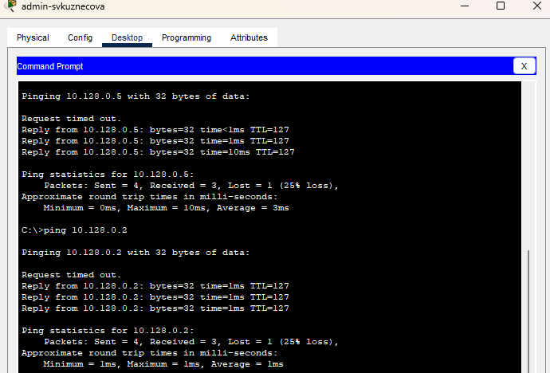{#fig:004 width=65%}

## Настройка доступа к web-серверу по порту tcp 80

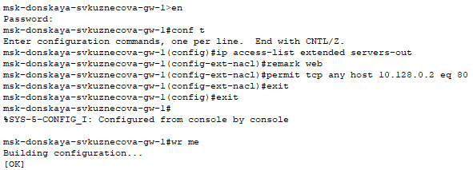{#fig:005 width=70%}

## Добавление списка управления доступом к интерфейсу

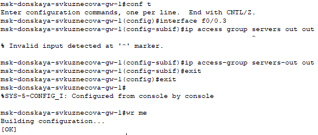{#fig:006 width=70%}

## Проверка

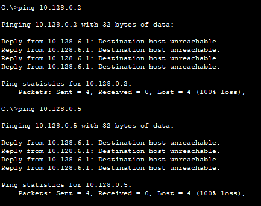{#fig:007 width=50%}

## Проверка

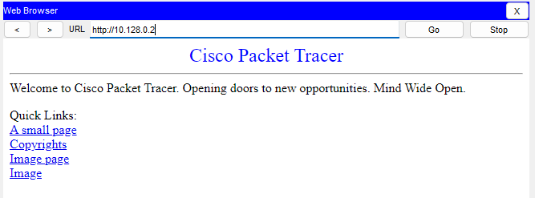{#fig:008 width=50%}

## Настроим дополнительный доступ для администратора по протоколам Telnet и FTP

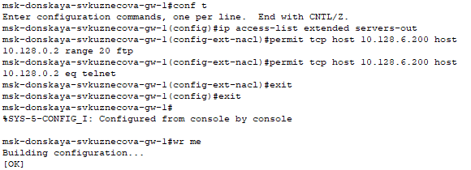{#fig:009 width=70%}

## Проверка

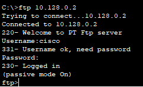{#fig:010 width=35%}

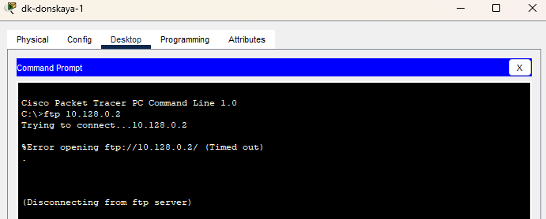{#fig:011 width=35%}

## Настройка доступа к файловому серверу

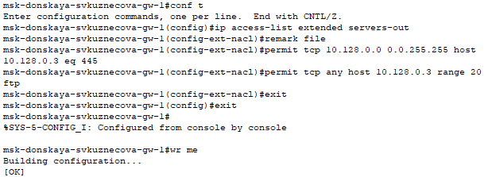{#fig:012 width=75%}

## Настройка доступа к почтовому серверу

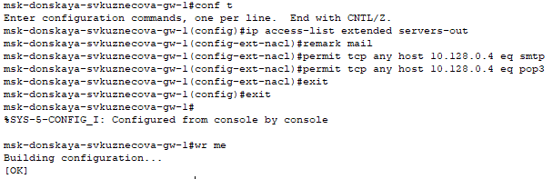{#fig:013 width=80%}

## Настройка доступа к DNS-серверу

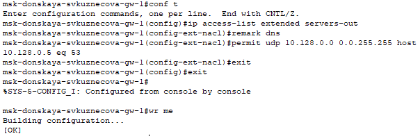{#fig:014 width=45%}

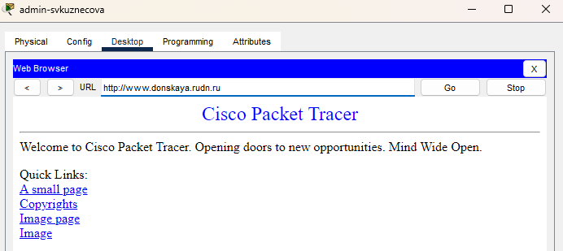{#fig:015 width=45%}

## Разрешим icmp-запросов

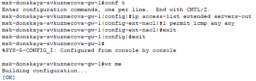{#fig:016 width=50%}

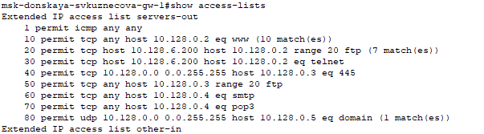{#fig:017 width=50%}

## Настройка доступа для сети Other

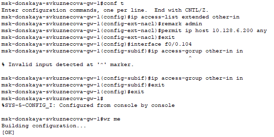{#fig:018 width=60%}

## Настройка доступа администратора к сети сетевого оборудования

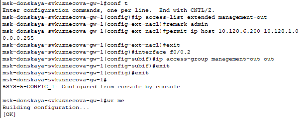{#fig:019 width=60%}

## Проверим корректность 

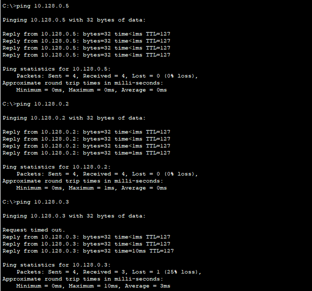{#fig:020 width=40%}

## Проверим корректность 

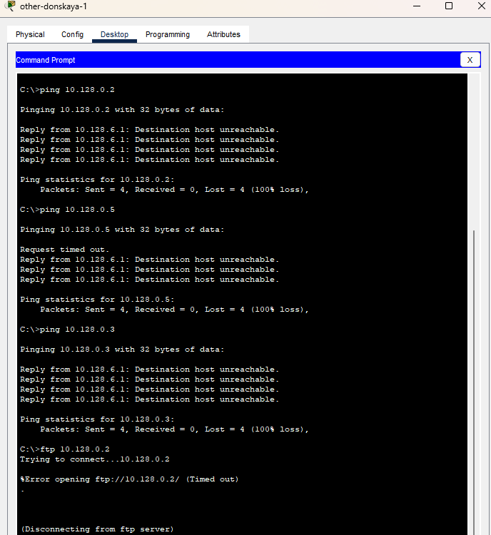{#fig:021 width=40%}

## Разрешим администратору из сети Other на Павловской действия, аналогичные действиям администратора сети Other на Донской

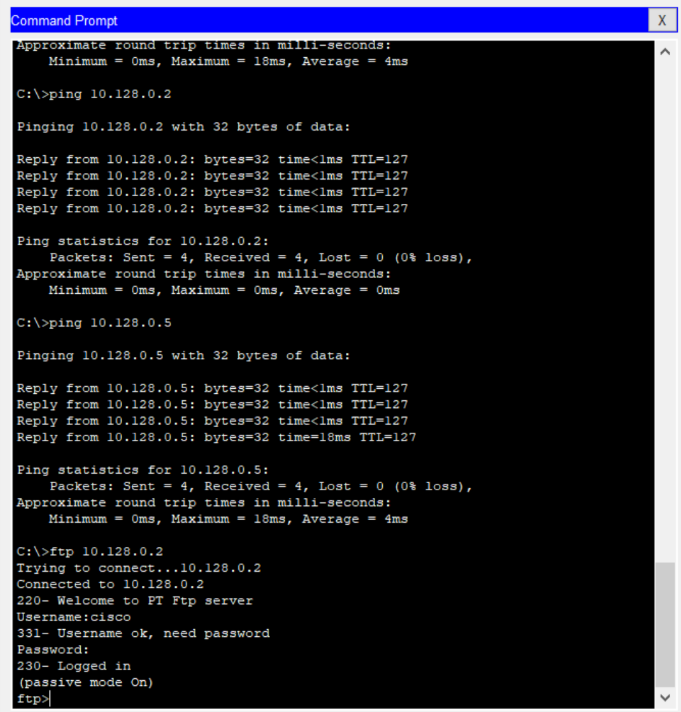{#fig:022 width=40%}

# Выводы

В ходе выполнения лабораторной работы мы освоили настройку прав доступа польНастройка доступа к web-серверу по порту tcp 80зователей к ресурсам сети.

## {.standout}

Спасибо за внимание!
