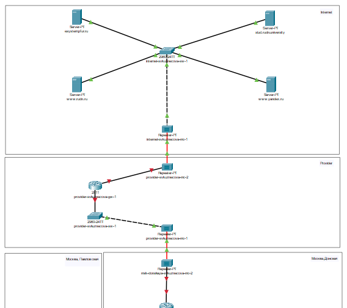
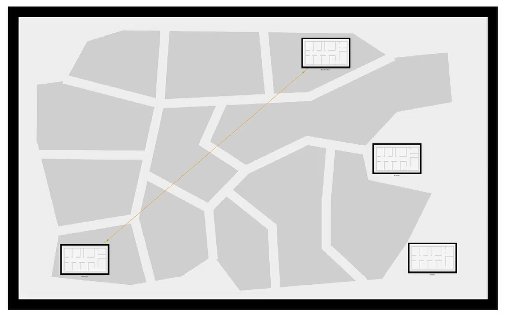
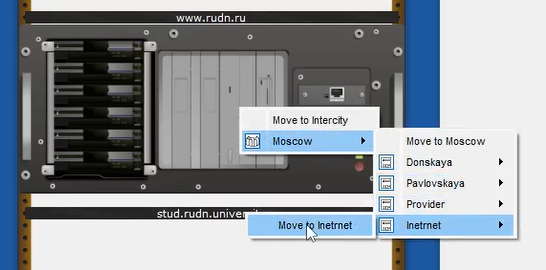
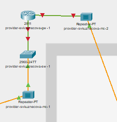
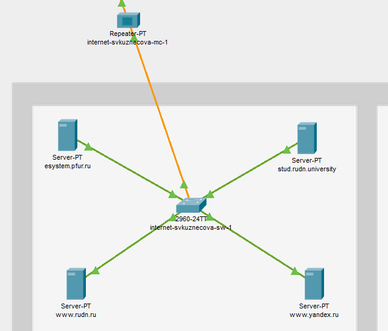
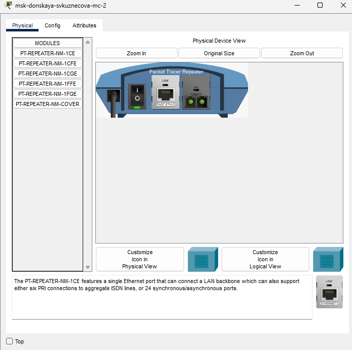
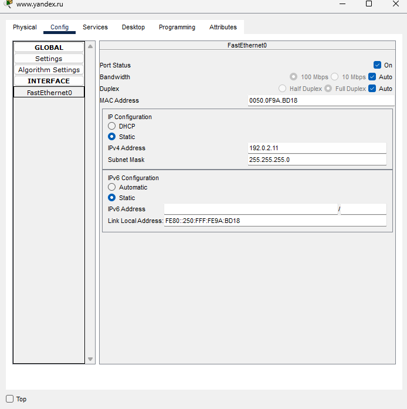
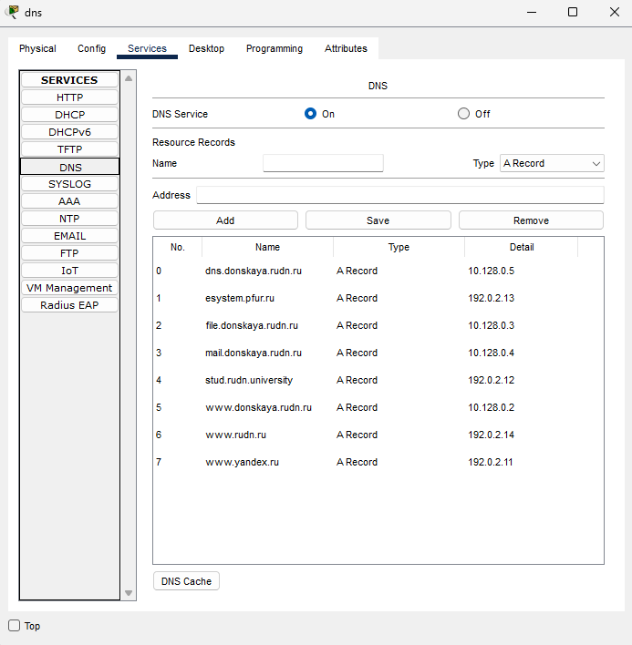

---
## Front matter
lang: ru-RU
title: Лабораторная работы №11
subtitle: Настройка NAT. Планирование
author:
  - Кузнецова С. В.
institute:
  - Российский университет дружбы народов, Москва, Россия
date: 25 апреля 2025

## i18n babel
babel-lang: russian
babel-otherlangs: english

## Formatting pdf
toc: false
toc-title: Содержание
slide_level: 2
aspectratio: 169
section-titles: true
theme: metropolis
header-includes:
 - \metroset{progressbar=frametitle,sectionpage=progressbar,numbering=fraction}
---

# Информация

## Докладчик

:::::::::::::: {.columns align=center}
::: {.column width="70%"}

  * Кузнецова София Вадимовна
  * Российский университет дружбы народов

:::
::: {.column width="30%"}

:::
::::::::::::::

# Ход работы

## Создание нового проекта lab_PT-11.pkt

{ #fig:001 width=80% }

## 4 медиаконвертера (Repeater-PT), 2 коммутатора типа Cisco 2960-24TT, маршрутизатор типа Cisco 2811, 4 сервера

{#fig:002 width=50%}

## Физическая рабочая область 

{#fig:003 width=70%}

## Оборудование провайдера и модельной сети Интернета

{#fig:004 width=70%}

## Провайдер

{#fig:005 width=45%}

## Интернет

{#fig:006 width=45%}

## Замена имеющихся модулей на медиаконвертерах 

{#fig:007 width=40%}

## IP-адреса серверов 

{#fig:008 width=40%}

## Cведения о серверах 

{#fig:009 width=40%}

# Выводы

В ходе выполнения лабораторной работы мы освоили настройку прав доступа пользователей к ресурсам сети.

## {.standout}

Спасибо за внимание!
