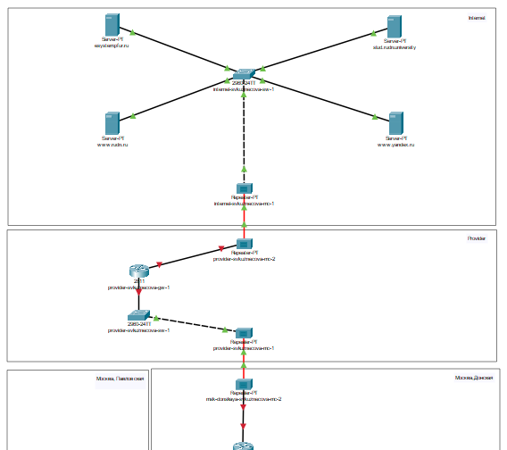
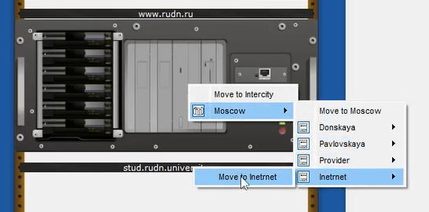
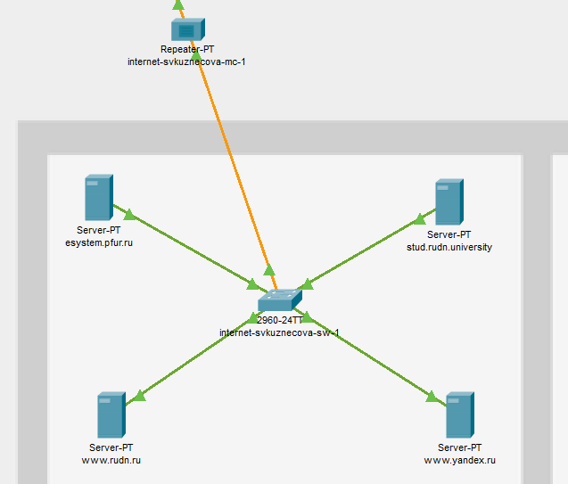
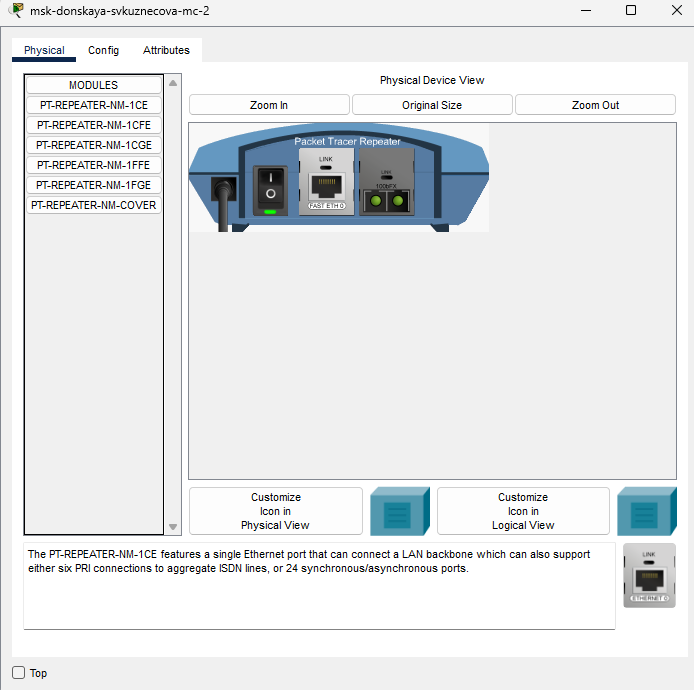
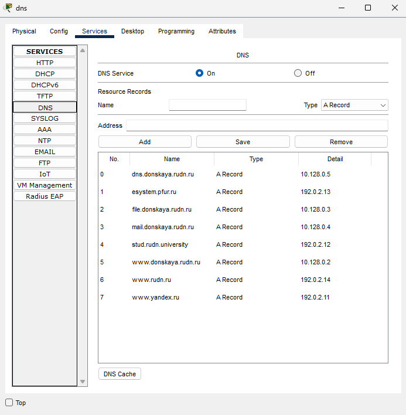

---
## Front matter
title: "Отчёт по лабораторной работе №11"
subtitle: "дисциплина: Администрирование локальных сетей"
author: "Студент: Кузнецова София Вадимовна"

## Generic otions
lang: ru-RU
toc-title: "Содержание"

## Bibliography
bibliography: bib/cite.bib
csl: pandoc/csl/gost-r-7-0-5-2008-numeric.csl

## Pdf output format
toc: true # Table of contents
toc-depth: 2
lof: true # List of figures
lot: true # List of tables
fontsize: 12pt
linestretch: 1.5
papersize: a4
documentclass: scrreprt
## I18n polyglossia
polyglossia-lang:
  name: russian
  options:
	- spelling=modern
	- babelshorthands=true
polyglossia-otherlangs:
  name: english
## I18n babel
babel-lang: russian
babel-otherlangs: english
## Fonts
mainfont: IBM Plex Serif
romanfont: IBM Plex Serif
sansfont: IBM Plex Sans
monofont: IBM Plex Mono
mathfont: STIX Two Math
mainfontoptions: Ligatures=Common,Ligatures=TeX,Scale=0.94
romanfontoptions: Ligatures=Common,Ligatures=TeX,Scale=0.94
sansfontoptions: Ligatures=Common,Ligatures=TeX,Scale=MatchLowercase,Scale=0.94
monofontoptions: Scale=MatchLowercase,Scale=0.94,FakeStretch=0.9
mathfontoptions:
## Biblatex
biblatex: true
biblio-style: "gost-numeric"
biblatexoptions:
  - parentracker=true
  - backend=biber
  - hyperref=auto
  - language=auto
  - autolang=other*
  - citestyle=gost-numeric
## Pandoc-crossref LaTeX customization
figureTitle: "Рис."
tableTitle: "Таблица"
listingTitle: "Листинг"
lofTitle: "Список иллюстраций"
lotTitle: "Список таблиц"
lolTitle: "Листинги"
## Misc options
indent: true
header-includes:
  - \usepackage{indentfirst}
  - \usepackage{float} # keep figures where there are in the text
  - \floatplacement{figure}{H} # keep figures where there are in the text
---

# Цель работы

Провести подготовительные мероприятия по подключению локальной сети организации к Интернету.

# Выполнение лабораторной работы

Откроем проект с названием lab_PT-10.pkt и сохраним под названием lab_PT-11.pkt. После чего откроем его для дальнейшего редактирования.

{#fig:001 width=70%}

На схеме нашего проекта разместим согласно заданию лабораторной работы необходимое оборудование для сети провайдера и сети модельного Интернета: 4 медиаконвертера (Repeater-PT), 2 коммутатора типа Cisco 2960-24TT, маршрутизатор типа Cisco 2811, 4 сервера. Присвоим названия размещённым в сети провайдера и в сети модельного Интернета объектам согласно правилам именования.

{#fig:002 width=70%}

В физической рабочей области добавим здание провайдера и здание, имитирующее расположение серверов модельного Интернета. Присвоим им соответствующие названия.

{#fig:003 width=70%}

Перенесём из сети «Донская» оборудование провайдера и модельной сети Интернета в соответствующие здания.

{#fig:004 width=70%}

{#fig:005 width=70%}

{#fig:006 width=70%}

На медиаконвертерах заменим имеющиеся модули на PT-REPEATER-NM-1FFE и PT-REPEATER-NM-1CFE для подключения витой пары по технологии Fast Ethernet и оптоволокна соответственно.

{#fig:007 width=70%}

Пропишем IP-адреса серверам согласно таблице в лабораторной работе.

{#fig:008 width=70%}

После чего пропишем сведения о серверах на DNS-сервере сети «Донская».

{#fig:009 width=70%}

# Выводы

В ходе выполнения лабораторной работы мы освоили настройку прав доступа пользователей к ресурсам сети.

# Ответы на контрольные вопросы

1. Что такое Network Address Translation (NAT)? 
- Network Address Translation (NAT) — механизм преобразования IP-адресов транзитных пакетов.

2. Как определить, находится ли узел сети за NAT?
• Просмотр сетевой конфигурации: если узел имеет локальный IP-адрес из диапазона 192.168.x.x, 10.x.x.x или
172.16.x.x, вероятно, он находится за NAT.
• Проверка маршрутизации: при использовании traceroute (tracert в Windows) можно увидеть IP-адреса маршрута. Если он проходит через общедоступные IP-адреса, узел, скорее всего, за NAT.
• Проверка портов: если администратор сети настроил порты NAT для перенаправления трафика на устройства внутри локальной сети, подключение к определенному порту на общедоступном IP- адресе может указывать на использование NAT.
• Использование онлайн-инструментов: некоторые онлайн-сервисы могут анализировать IP-адрес узла и определить, используется ли NAT.

3. Какое оборудование отвечает за преобразование адреса методом NAT?
- Оборудование, отвечающее за преобразование адресов методом NAT, включает в себя маршрутизаторы (роутеры), межсетевые экраны (firewalls) и прокси-серверы.

4. В чём отличие статического, динамического и перегруженного NAT?
• Статический NAT (SNAT): каждый локальный IP-адрес отображается на соответствующий общедоступный IP-адрес.
• Динамический NAT (DNAT): локальные IP-адреса отображаются на общедоступные IP-адреса из пула, с временным выделением адресов.
• NAT с перегрузкой (Overloaded NAT или PAT): в этом случае, помимо изменения IP-адресов, также происходит изменение портов, позволяя множеству устройств использовать один общедоступный IP-адрес.

5. Охарактеризуйте типы NAT.
• Cтатический NAT (Static NAT, SNAT) — осуществляет преобразование адресов по принципу 1:1 (в частности, один локальный IP-адрес преобразуется во внешний адрес, выделенный, например, провайдером);
• Динамический NAT (Dynamic NAT, DNAT) — осуществляет преобразование адресов по принципу 1:N (например, один адрес устройства локальной сети преобразуется в один из адресов диапазона внешних адресов);
• NAT Overload (или NAT Masquerading, или Port Address Translation, PAT) — осуществляет преобразование адресов по принципу N:1 (например, адреса группы устройств локальной подсети преобразуются в один внешний адрес, при этом дополнительно используется механизм адресации через номера портов).
