---
## Front matter
lang: ru-RU
title: Лабораторная работа №12
subtitle: Настройка NAT
author:
  - Кузнецова С. В.
institute:
  - Российский университет дружбы народов, Москва, Россия
date: 26 апреля 2025

## i18n babel
babel-lang: russian
babel-otherlangs: english

## Formatting pdf
toc: false
toc-title: Содержание
slide_level: 2
aspectratio: 169
section-titles: true
theme: metropolis
header-includes:
 - \metroset{progressbar=frametitle,sectionpage=progressbar,numbering=fraction}
---

# Информация

## Докладчик

:::::::::::::: {.columns align=center}
::: {.column width="70%"}

  * Кузнецова София Вадимовна
  * Российский университет дружбы народов

:::
::: {.column width="30%"}

:::
::::::::::::::

# Ход работы

## Создание нового проекта lab_PT-11.pkt

{ #fig:001 width=80% }

## Первоначальная настройка маршрутизатора provider-svkuznecova-gw-1 провайдера (зададим имя, настроим доступ по паролю и т.п.)

{#fig:002 width=70%}

## Первоначальная настройка коммутатора provider-svkuznecova-sw-1 провайдера (зададим имя, настроим доступ по паролю и т.п.)

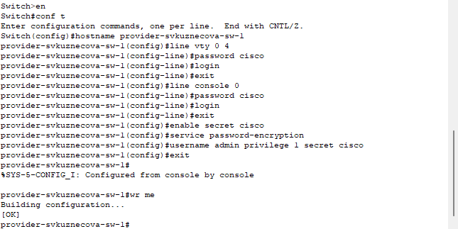{#fig:003 width=70%}

## Настройка интерфейса маршрутизатора provider-svkuznecova-gw-1 провайдера

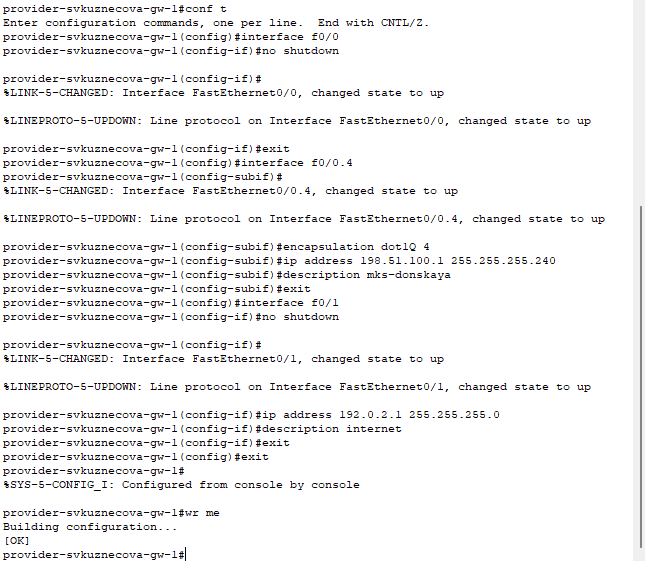{#fig:004 width=50%}

## Настройка интерфейса коммутатора provider-svkuznecova-sw-1 провайдера

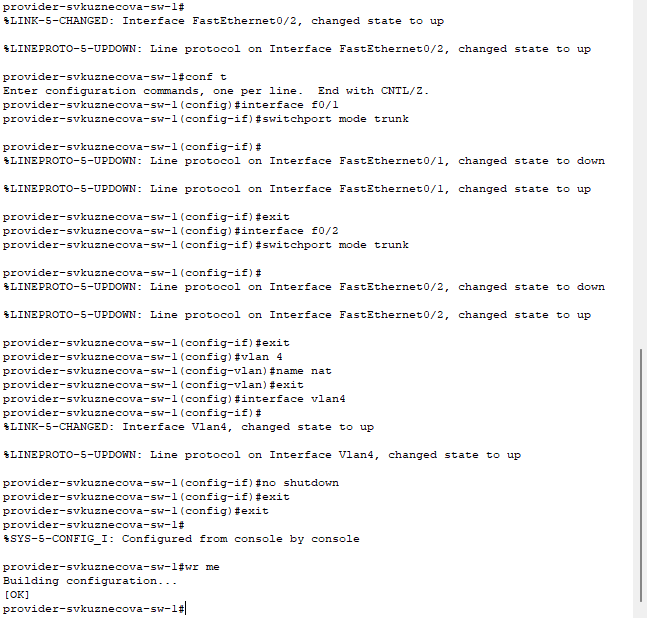{#fig:005 width=50%}

## Проверка

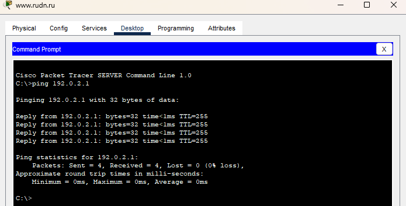{#fig:006 width=70%}

## Настройка интерфейсов маршрутизатора сети «Донская» для доступа к сети провайдера

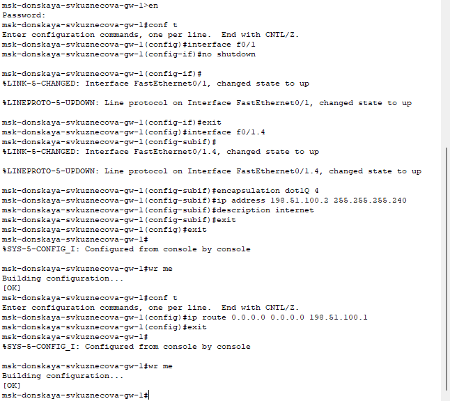{#fig:007 width=50%}

## Проверка

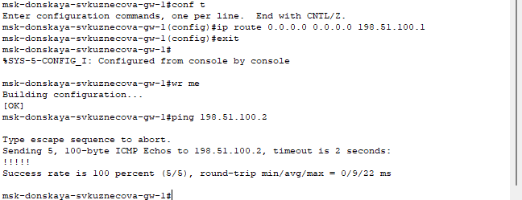{#fig:008 width=70%}

## Настройка на маршрутизаторе сети «Донская» NAT с правилами, указанными в лабораторной работе

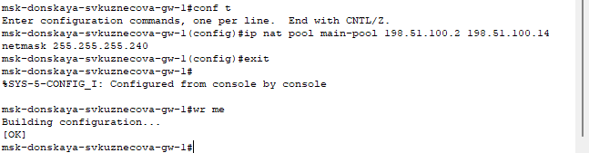{#fig:009 width=70%}

## Настройка на маршрутизаторе сети «Донская» NAT с правилами, указанными в лабораторной работе

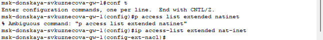{#fig:010 width=70%}

## Настройка на маршрутизаторе сети «Донская» NAT с правилами, указанными в лабораторной работе

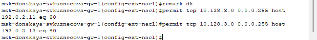{#fig:011 width=70%}

## Настройка на маршрутизаторе сети «Донская» NAT с правилами, указанными в лабораторной работе

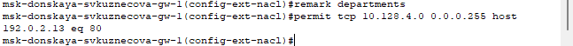{#fig:012 width=70%}

## Настройка на маршрутизаторе сети «Донская» NAT с правилами, указанными в лабораторной работе

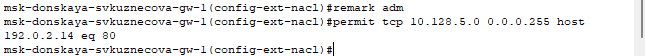{#fig:013 width=70%}

## Настройка на маршрутизаторе сети «Донская» NAT с правилами, указанными в лабораторной работе

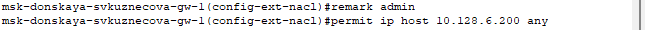{#fig:014 width=70%}

## Настройка на маршрутизаторе сети «Донская» NAT с правилами, указанными в лабораторной работе

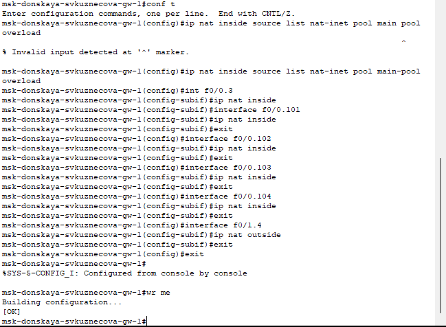{#fig:015 width=60%}

## Проверка работоспособности

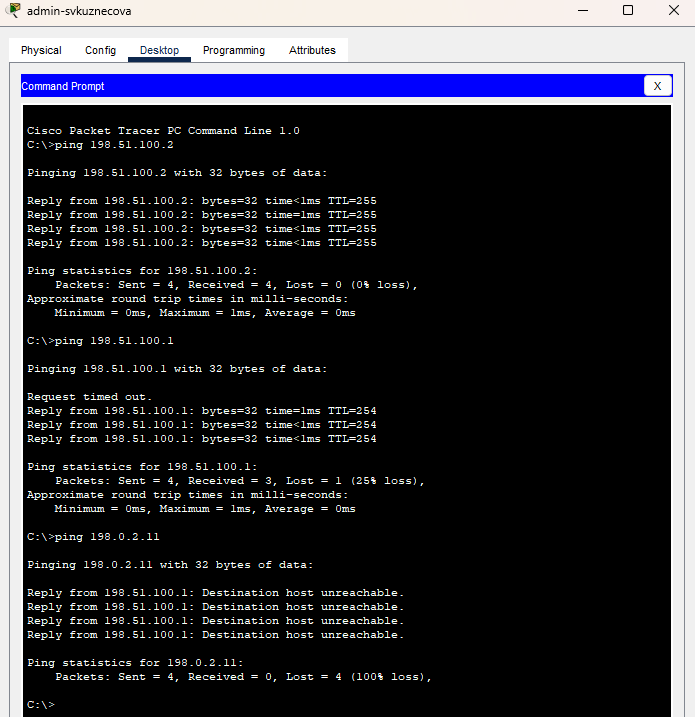{#fig:016 width=40%}

## Проверка работоспособности

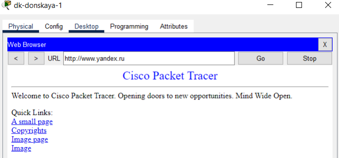{#fig:017 width=70%}

## Настройка доступа из внешней сети в локальную сеть организации, как указано в лабораторной работе

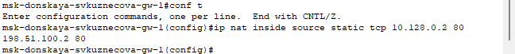{#fig:018 width=70%}

## Настройка доступа из внешней сети в локальную сеть организации, как указано в лабораторной работе

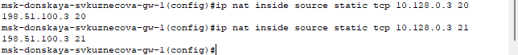{#fig:019 width=70%}

## Настройка доступа из внешней сети в локальную сеть организации, как указано в лабораторной работе

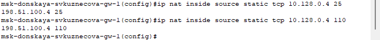{#fig:020 width=70%}

## Настройка доступа из внешней сети в локальную сеть организации, как указано в лабораторной работе

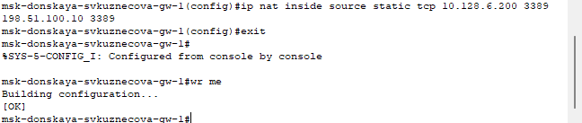{#fig:021 width=70%}

## Проверка работоспособности

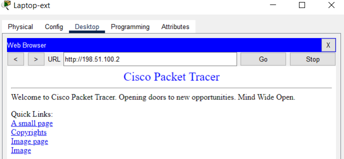{#fig:022 width=70%}

# Выводы

В ходе выполнения лабораторной работы мы приобрели практические навыки по настройке доступа локальной сети к внешней сети посредством NAT.

## {.standout}

Спасибо за внимание!
