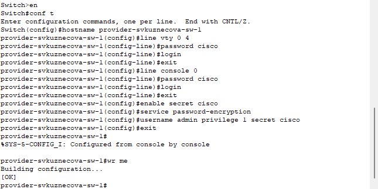
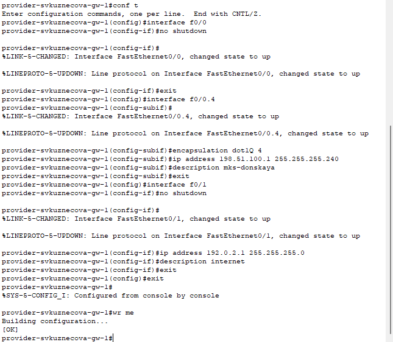
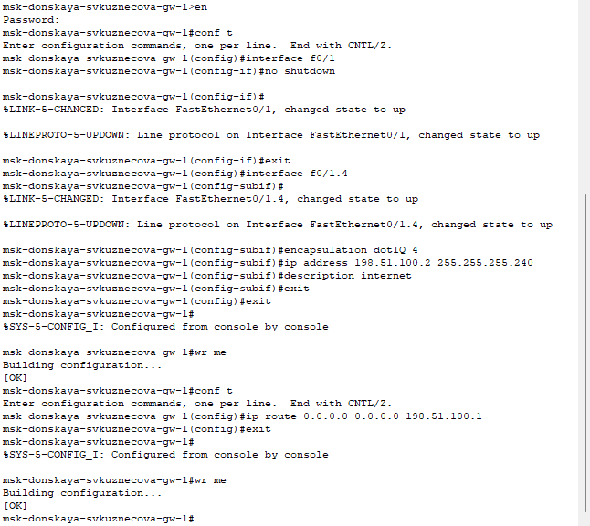
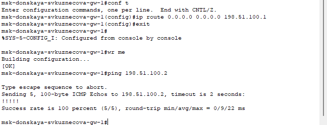
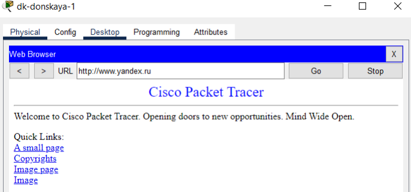
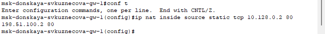
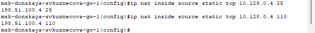
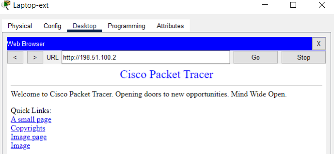

---
## Front matter
title: "Отчёт по лабораторной работе №12"
subtitle: "дисциплина: Администрирование локальных сетей"
author: "Студент: Кузнецова София Вадимовна"

## Generic otions
lang: ru-RU
toc-title: "Содержание"

## Bibliography
bibliography: bib/cite.bib
csl: pandoc/csl/gost-r-7-0-5-2008-numeric.csl

## Pdf output format
toc: true # Table of contents
toc-depth: 2
lof: true # List of figures
lot: true # List of tables
fontsize: 12pt
linestretch: 1.5
papersize: a4
documentclass: scrreprt
## I18n polyglossia
polyglossia-lang:
  name: russian
  options:
	- spelling=modern
	- babelshorthands=true
polyglossia-otherlangs:
  name: english
## I18n babel
babel-lang: russian
babel-otherlangs: english
## Fonts
mainfont: IBM Plex Serif
romanfont: IBM Plex Serif
sansfont: IBM Plex Sans
monofont: IBM Plex Mono
mathfont: STIX Two Math
mainfontoptions: Ligatures=Common,Ligatures=TeX,Scale=0.94
romanfontoptions: Ligatures=Common,Ligatures=TeX,Scale=0.94
sansfontoptions: Ligatures=Common,Ligatures=TeX,Scale=MatchLowercase,Scale=0.94
monofontoptions: Scale=MatchLowercase,Scale=0.94,FakeStretch=0.9
mathfontoptions:
## Biblatex
biblatex: true
biblio-style: "gost-numeric"
biblatexoptions:
  - parentracker=true
  - backend=biber
  - hyperref=auto
  - language=auto
  - autolang=other*
  - citestyle=gost-numeric
## Pandoc-crossref LaTeX customization
figureTitle: "Рис."
tableTitle: "Таблица"
listingTitle: "Листинг"
lofTitle: "Список иллюстраций"
lotTitle: "Список таблиц"
lolTitle: "Листинги"
## Misc options
indent: true
header-includes:
  - \usepackage{indentfirst}
  - \usepackage{float} # keep figures where there are in the text
  - \floatplacement{figure}{H} # keep figures where there are in the text
---

# Цель работы

Приобретение практических навыков по настройке доступа локальной сети к внешней сети посредством NAT.

# Выполнение лабораторной работы

Откроем проект с названием lab_PT-11.pkt и сохраним под названием lab_PT-12.pkt. После чего откроем его для дальнейшего редактирования.

{#fig:001 width=70%}

Для начала сделаем первоначальную настройку маршрутизатора provider-svkuznecova-gw-1 и коммутатора provider-svkuznecova-sw-1 провайдера: зададим имя, настроим доступ по паролю и т.п.

{#fig:002 width=70%}

{#fig:003 width=70%}

Теперь настроим интерфейсы маршрутизатора provider-svkuznecova-gw-1 и коммутатора provider-svkuznecova-sw-1 провайдера.

{#fig:004 width=70%}

{#fig:005 width=70%}

Выполним проверку командой ping с сервера www.rudn.ru на роутер провайдера.

{#fig:006 width=70%}

Следующим шагом настроим интерфейсы маршрутизатора сети «Донская» для доступа к сети провайдера.

{#fig:007 width=70%}

Выполним проверку.

{#fig:008 width=70%}

Настроим на маршрутизаторе сети «Донская» NAT с правилами, указанными в лабораторной работе.

{#fig:009 width=70%}

{#fig:010 width=70%}

{#fig:011 width=70%}

{#fig:012 width=70%}

{#fig:013 width=70%}

{#fig:014 width=70%}

{#fig:015 width=70%}

{#fig:016 width=70%}

{#fig:017 width=70%}

На последнем шаге настроим доступ из внешней сети в локальную сеть организации, как указано в лабораторной работе.

{#fig:018 width=70%}

{#fig:019 width=70%}

{#fig:020 width=70%}

{#fig:021 width=70%}

{#fig:022 width=70%}

# Выводы

В ходе выполнения лабораторной работы мы приобрели практические навыки по настройке доступа локальной сети к внешней сети посредством NAT.

# Ответы на контрольные вопросы

1. В чём состоит основной принцип работы NAT (что даёт наличие NAT в сети организации)? 
- NAT на устройстве позволяет ему соединять публичные и частные сети между собой с помощью только одного IP-адреса для группы.

2. В чём состоит принцип настройки NAT (на каком оборудовании и что нужно настроить для из локальной сети во внешнюю сеть через NAT)?
- Настроить интерфейсы на внутренних и внешних маршрутизаторах, наборы правил для преобразования IP.

3. Можно ли применить Cisco IOS NAT к субинтерфейсам? 
- Да, поскольку они существуют в энергонезависимой памяти.

4. Что такое пулы IP NAT? 
- Выделяемые для трансляции NAT IP.

5. Что такое статические преобразования NAT? 
- Взаимно однозначное преобразование внутренних IP во внешние.
