---
## Front matter
lang: ru-RU
title: Лабораторная работа №13
subtitle: Статическая маршрутизация в Интернете. Планирование
author:
  - Кузнецова С. В.
institute:
  - Российский университет дружбы народов, Москва, Россия
date: 10 мая 2025

## i18n babel
babel-lang: russian
babel-otherlangs: english

## Formatting pdf
toc: false
toc-title: Содержание
slide_level: 2
aspectratio: 169
section-titles: true
theme: metropolis
header-includes:
 - \metroset{progressbar=frametitle,sectionpage=progressbar,numbering=fraction}
---

# Информация

## Докладчик

:::::::::::::: {.columns align=center}
::: {.column width="70%"}

  * Кузнецова София Вадимовна
  * Российский университет дружбы народов

:::
::: {.column width="30%"}

:::
::::::::::::::

# Ход работы

## Создание нового проекта lab_PT-13.pkt

{ #fig:001 width=80% }

## На схеме предыдущего проекта разместим необходимое оборудование

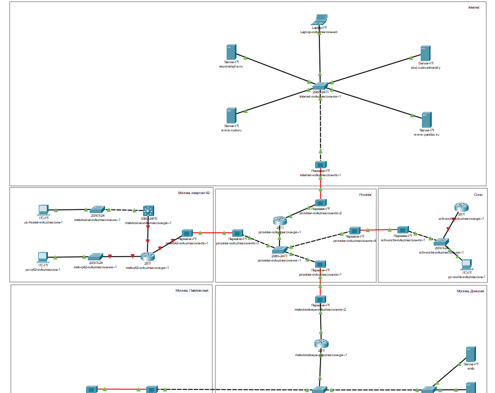{#fig:002 width=50%}

## Замена имеющихся модулей на PT-REPEATER-NM-1FFE и PT-REPEATER-NM-1CFE

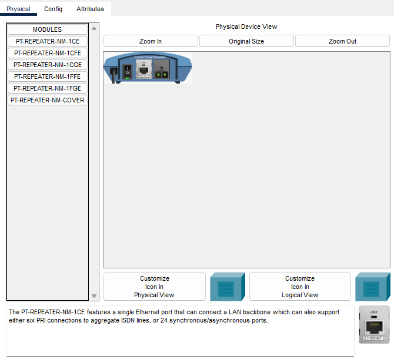{#fig:003 width=50%}

## Дополнительный интерфейс NM-2FE2W

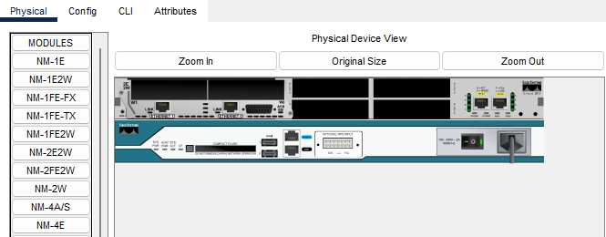{#fig:004 width=70%}

## Физическая рабочая области Packet Tracer

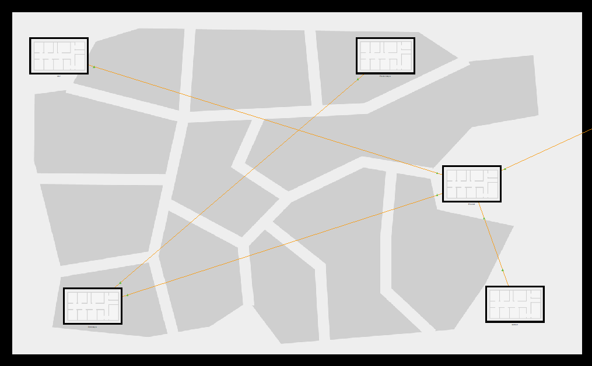{#fig:005 width=70%}

## Физическая рабочая области Packet Tracer

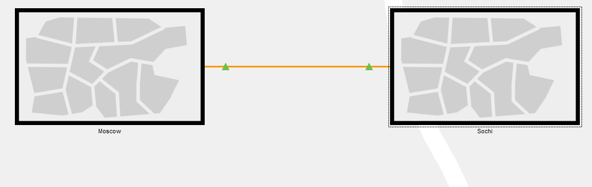{#fig:006 width=70%}

## Перенос из сети «Донская» оборудования

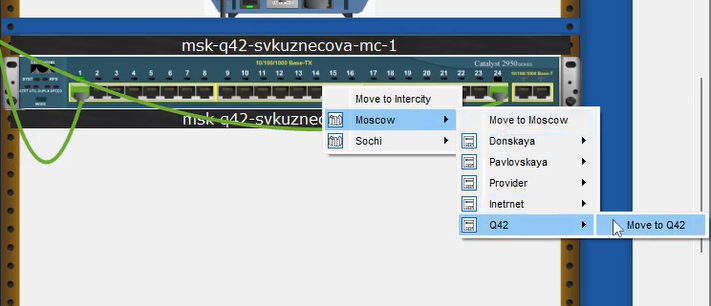{#fig:007 width=70%}

## Перенос из сети «Донская» оборудования

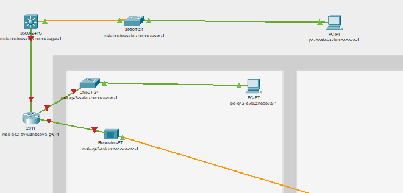{#fig:008 width=70%}

## Перенос из сети «Донская» оборудования

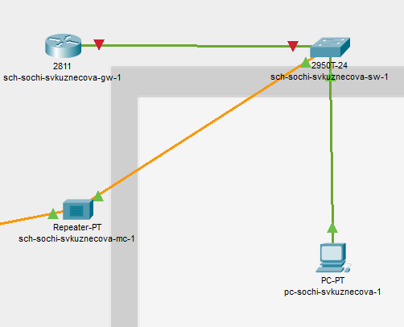{#fig:009 width=55%}

## На последнем шаге выполним первоначальную настройку оборудования

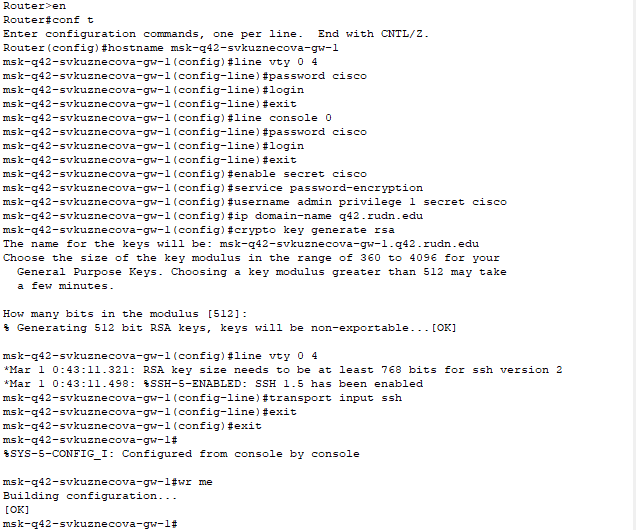{#fig:010 width=50%}

## На последнем шаге выполним первоначальную настройку оборудования

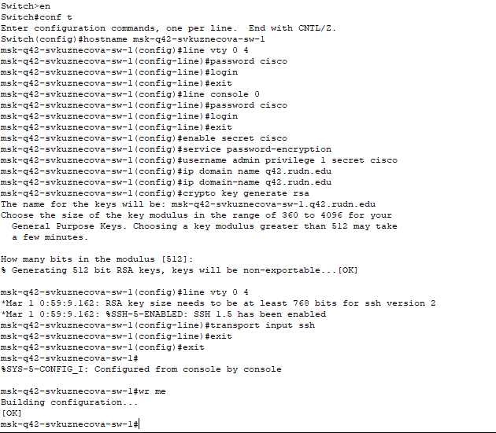{#fig:011 width=50%}

## На последнем шаге выполним первоначальную настройку оборудования

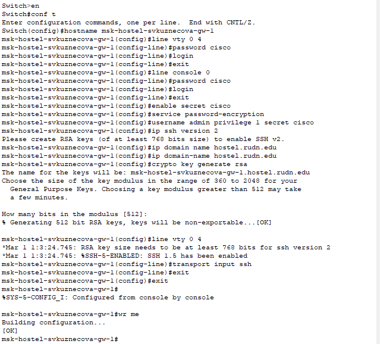{#fig:012 width=50%}

## На последнем шаге выполним первоначальную настройку оборудования

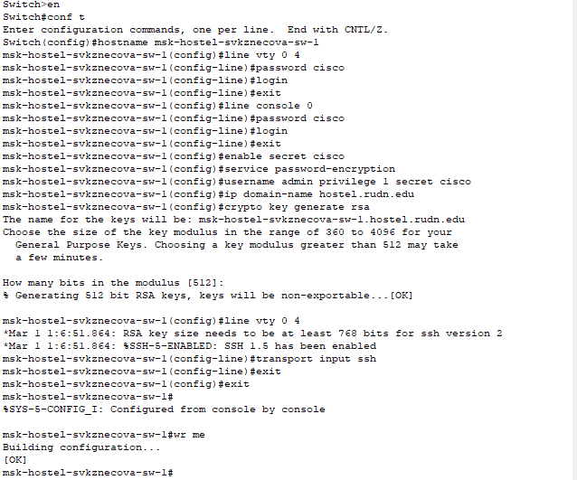{#fig:013 width=50%}

## На последнем шаге выполним первоначальную настройку оборудования

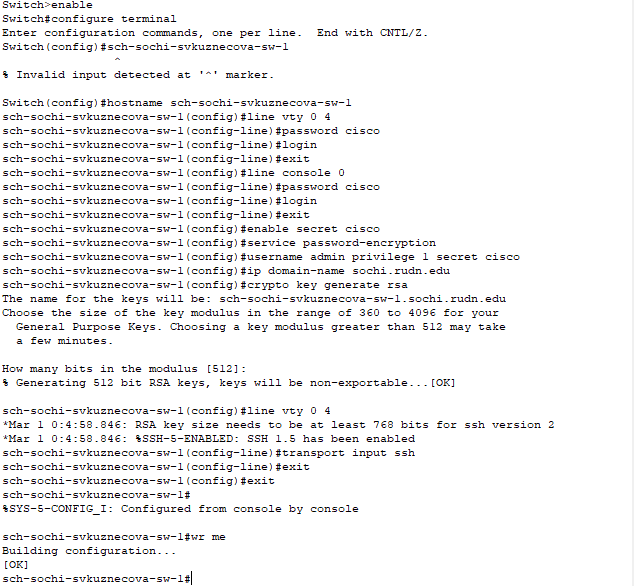{#fig:014 width=50%}

## На последнем шаге выполним первоначальную настройку оборудования

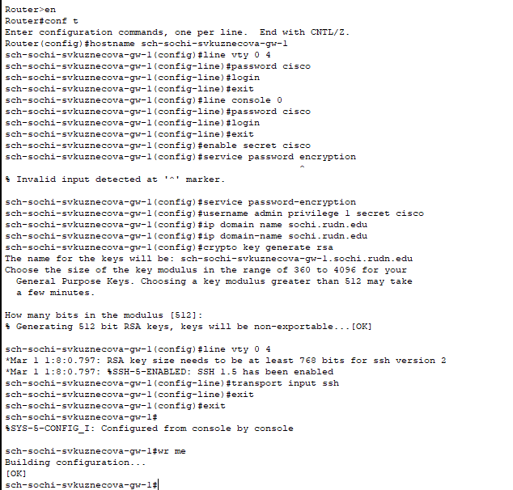{#fig:015 width=50%}

# Выводы

В ходе выполнения лабораторной работы мы провели подготовительные мероприятия по организации взаимодействия через сеть посредством статической маршрутизации локальной сети с сетью основного здания, расположенного в 42-м квартале в Москве, и сетью филиала, расположенного в г. Сочи.

## {.standout}

Спасибо за внимание!
