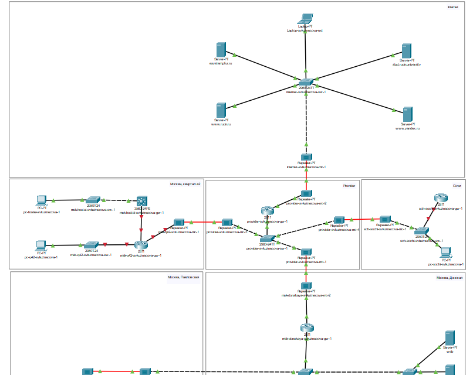
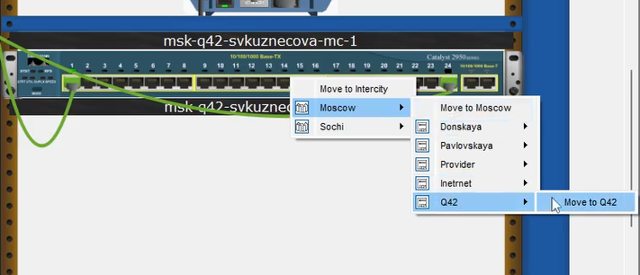
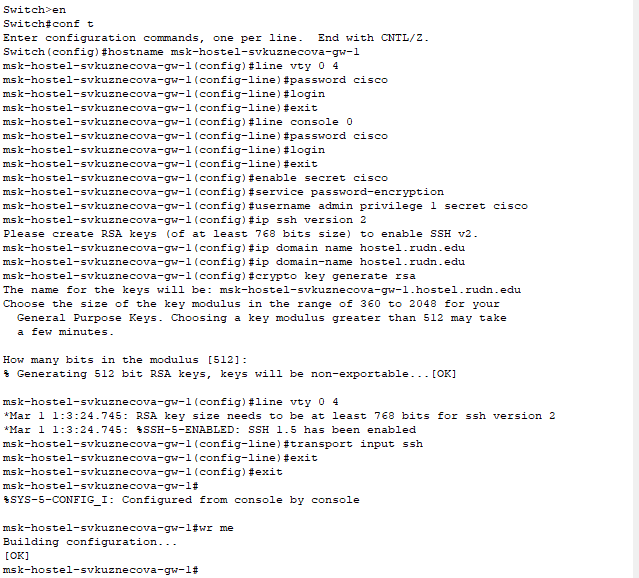
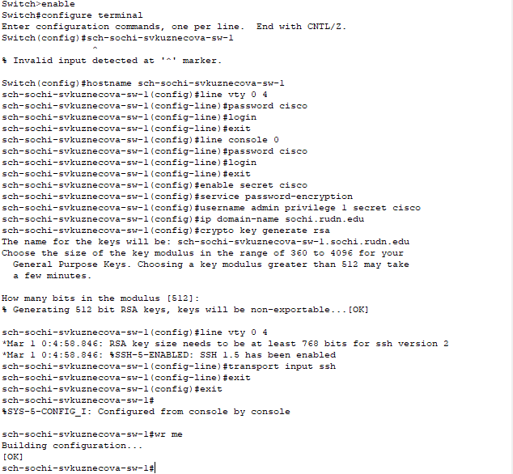

---
## Front matter
title: "Отчёт по лабораторной работе №13"
subtitle: "дисциплина: Администрирование локальных сетей"
author: "Студент: Кузнецова София Вадимовна"

## Generic otions
lang: ru-RU
toc-title: "Содержание"

## Bibliography
bibliography: bib/cite.bib
csl: pandoc/csl/gost-r-7-0-5-2008-numeric.csl

## Pdf output format
toc: true # Table of contents
toc-depth: 2
lof: true # List of figures
lot: true # List of tables
fontsize: 12pt
linestretch: 1.5
papersize: a4
documentclass: scrreprt
## I18n polyglossia
polyglossia-lang:
  name: russian
  options:
	- spelling=modern
	- babelshorthands=true
polyglossia-otherlangs:
  name: english
## I18n babel
babel-lang: russian
babel-otherlangs: english
## Fonts
mainfont: IBM Plex Serif
romanfont: IBM Plex Serif
sansfont: IBM Plex Sans
monofont: IBM Plex Mono
mathfont: STIX Two Math
mainfontoptions: Ligatures=Common,Ligatures=TeX,Scale=0.94
romanfontoptions: Ligatures=Common,Ligatures=TeX,Scale=0.94
sansfontoptions: Ligatures=Common,Ligatures=TeX,Scale=MatchLowercase,Scale=0.94
monofontoptions: Scale=MatchLowercase,Scale=0.94,FakeStretch=0.9
mathfontoptions:
## Biblatex
biblatex: true
biblio-style: "gost-numeric"
biblatexoptions:
  - parentracker=true
  - backend=biber
  - hyperref=auto
  - language=auto
  - autolang=other*
  - citestyle=gost-numeric
## Pandoc-crossref LaTeX customization
figureTitle: "Рис."
tableTitle: "Таблица"
listingTitle: "Листинг"
lofTitle: "Список иллюстраций"
lotTitle: "Список таблиц"
lolTitle: "Листинги"
## Misc options
indent: true
header-includes:
  - \usepackage{indentfirst}
  - \usepackage{float} # keep figures where there are in the text
  - \floatplacement{figure}{H} # keep figures where there are in the text
---

# Цель работы

Провести подготовительные мероприятия по организации взаимодействия через сеть провайдера посредством статической маршрутизации локальной сети с сетью основного здания, расположенного в 42-м квартале в Москве, и сетью филиала, расположенного в г. Сочи.

# Выполнение лабораторной работы

Откроем проект с названием lab_PT-12.pkt и сохраним под названием lab_PT-13.pkt. После чего откроем его для дальнейшего редактирования.

{#fig:001 width=70%}

На схеме предыдущего вашего проекта разместим необходимое оборудование: 4 медиаконвертера (Repeater-PT), 2 маршрутизатора типа Cisco 2811, 1 маршрутизирующий коммутатор типа Cisco 3560-24PS, 2 коммутатора типа Cisco 2950-24, коммутатор Cisco 2950-24T, 3 оконечных устройства типа PC-PT. А также присвоим им названия и проведём соединение объектов.

{#fig:002 width=70%}

На медиаконвертерах заменим имеющиеся модули на PT-REPEATER-NM-1FFE и PT-REPEATER-NM-1CFE для подключения витой пары по технологии Fast Ethernet и оптоволокна соответственно.

{#fig:003 width=70%}

Далее на маршрутизаторе msk-q42-svkuznecova-gw-1 добавим дополнительный интерфейс NM-2FE2W.

{#fig:004 width=70%}

В физической рабочей области Packet Tracer добавим в г. Москва здание 42-го квартала и присвоим ему соответствующее название.

{#fig:005 width=70%}

Затем в физической рабочей области Packet Tracer добавим город Сочи и в нём здание филиала, присвоим ему соответствующее название.

{#fig:006 width=70%}

Перенесём из сети «Донская» оборудование сети 42-го квартала и сети филиала в соответствующие здания.

{#fig:007 width=70%}

{#fig:008 width=70%}

{#fig:009 width=70%}

На последнем шаге выполним первоначальную настройку оборудования.

{#fig:010 width=70%}

{#fig:011 width=70%}

{#fig:012 width=70%}

{#fig:013 width=70%}

{#fig:014 width=70%}

{#fig:015 width=70%}

# Выводы

В ходе выполнения лабораторной работы мы провели подготовительные мероприятия по организации взаимодействия через сеть посредством статической маршрутизации локальной сети с сетью основного здания, расположенного в 42-м квартале в Москве, и сетью филиала, расположенного в г. Сочи.

# Ответы на контрольные вопросы

1. В каких случаях следует использовать статическую маршрутизацию? Приведите примеры.
- В реальных условиях статическая маршрутизация используется в условиях наличия шлюза по умолчанию (узла, обладающего связностью с остальными узлами) и 1-2 сетями. Помимо этого, статическая маршрутизация используется для «выравнивания» работы маршрутизирующих протоколов в условиях наличия туннеля (для того, чтобы маршрутизация трафика, создаваемого туннелем, не производилась через сам туннель).

2. Укажите основные принципы статической маршрутизации между VLANs. 
- Процесс маршрутизации на 3-м уровне можно осуществлять с помощью маршрутизатора или коммутатора 3-го уровня. Использование устройства 3- го уровня обеспечивает возможность управления передачей трафика между сегментами сети, в том числе сегментами, которые были созданы с помощью VLAN.
