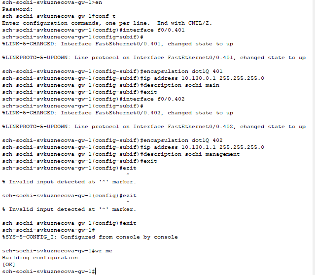

---
## Front matter
lang: ru-RU
title: Лабораторная работа №14
subtitle: Статическая маршрутизация в Интернете. Настройка
author:
  - Кузнецова С. В.
institute:
  - Российский университет дружбы народов, Москва, Россия
date: 10 мая 2025

## i18n babel
babel-lang: russian
babel-otherlangs: english

## Formatting pdf
toc: false
toc-title: Содержание
slide_level: 2
aspectratio: 169
section-titles: true
theme: metropolis
header-includes:
 - \metroset{progressbar=frametitle,sectionpage=progressbar,numbering=fraction}
---

# Информация

## Докладчик

:::::::::::::: {.columns align=center}
::: {.column width="70%"}

  * Кузнецова София Вадимовна
  * Российский университет дружбы народов

:::
::: {.column width="30%"}

:::
::::::::::::::

# Ход работы

## Создание нового проекта lab_PT-14.pkt

{ #fig:001 width=80% }

## Настройка линка между площадками

{#fig:002 width=40%}

## Настройка линка между площадками

{#fig:003 width=55%}

## Настройка линка между площадками

{#fig:004 width=55%}

## Настройка линка между площадками

{#fig:005 width=55%}

## Настройка линка между площадками

{#fig:006 width=55%}

## Настройка площадки 42-го квартала

{#fig:007 width=40%}

## Настройка площадки 42-го квартала

{#fig:008 width=55%}

## Настройка площадки 42-го квартала

{#fig:009 width=45%}

## Настройка площадки 42-го квартала

{#fig:010 width=50%}

## Настройка площадки в Сочи

{#fig:011 width=50%}

## Настройка площадки в Сочи

{#fig:012 width=55%}

## Настройка маршрутизации между площадками

{#fig:013 width=65%}

## Настройка маршрутизации между площадками

{#fig:014 width=70%}

## Настройка маршрутизации между площадками

{#fig:015 width=65%}

## Настройка маршрутизации на 42 квартале

{#fig:016 width=65%}

## Настройка маршрутизации на 42 квартале

{#fig:017 width=60%}

## Настройка NAT на маршрутизаторе msk-donskaya-svkuznecova-gw-1

{#fig:018 width=55%}

# Выводы

В ходе выполнения лабораторной работы мы настроили взаимодействие через сеть провайдера посредством статической маршрутизации локальной сети организации с сетью основного здания, расположенного в 42-м квартале в Москве, и сетью филиала, расположенного в г. Сочи.

## {.standout}

Спасибо за внимание!
