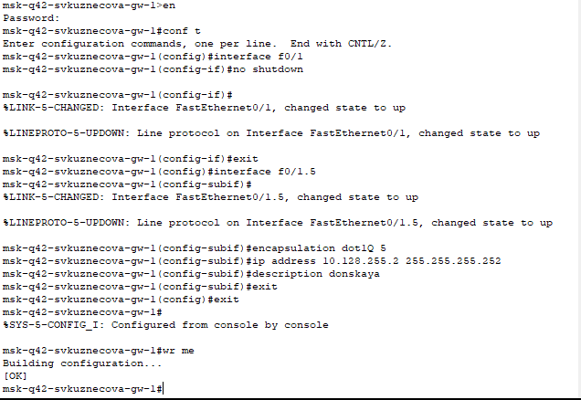

---
## Front matter
title: "Отчёт по лабораторной работе №14"
subtitle: "дисциплина: Администрирование локальных сетей"
author: "Студент: Кузнецова София Вадимовна"

## Generic otions
lang: ru-RU
toc-title: "Содержание"

## Bibliography
bibliography: bib/cite.bib
csl: pandoc/csl/gost-r-7-0-5-2008-numeric.csl

## Pdf output format
toc: true # Table of contents
toc-depth: 2
lof: true # List of figures
lot: true # List of tables
fontsize: 12pt
linestretch: 1.5
papersize: a4
documentclass: scrreprt
## I18n polyglossia
polyglossia-lang:
  name: russian
  options:
	- spelling=modern
	- babelshorthands=true
polyglossia-otherlangs:
  name: english
## I18n babel
babel-lang: russian
babel-otherlangs: english
## Fonts
mainfont: IBM Plex Serif
romanfont: IBM Plex Serif
sansfont: IBM Plex Sans
monofont: IBM Plex Mono
mathfont: STIX Two Math
mainfontoptions: Ligatures=Common,Ligatures=TeX,Scale=0.94
romanfontoptions: Ligatures=Common,Ligatures=TeX,Scale=0.94
sansfontoptions: Ligatures=Common,Ligatures=TeX,Scale=MatchLowercase,Scale=0.94
monofontoptions: Scale=MatchLowercase,Scale=0.94,FakeStretch=0.9
mathfontoptions:
## Biblatex
biblatex: true
biblio-style: "gost-numeric"
biblatexoptions:
  - parentracker=true
  - backend=biber
  - hyperref=auto
  - language=auto
  - autolang=other*
  - citestyle=gost-numeric
## Pandoc-crossref LaTeX customization
figureTitle: "Рис."
tableTitle: "Таблица"
listingTitle: "Листинг"
lofTitle: "Список иллюстраций"
lotTitle: "Список таблиц"
lolTitle: "Листинги"
## Misc options
indent: true
header-includes:
  - \usepackage{indentfirst}
  - \usepackage{float} # keep figures where there are in the text
  - \floatplacement{figure}{H} # keep figures where there are in the text
---

# Цель работы

Настроить взаимодействие через сеть провайдера посредством статической маршрутизации локальной сети организации с сетью основного здания, расположенного в 42-м квартале в Москве, и сетью филиала, расположенного в г. Сочи.

# Выполнение лабораторной работы

Откроем проект с названием lab_PT-13.pkt и сохраним под названием lab_PT-14.pkt. После чего откроем его для дальнейшего редактирования.

{#fig:001 width=70%}

Настроим линк между площадками.

{#fig:002 width=70%}

{#fig:003 width=70%}

{#fig:004 width=70%}

{#fig:005 width=70%}

{#fig:006 width=70%}

Настроим площадку 42-го квартала.

{#fig:007 width=70%}

{#fig:008 width=70%}

{#fig:009 width=70%}

{#fig:010 width=70%}

Настроим площадку в Сочи.

{#fig:011 width=70%}

{#fig:012 width=70%}

Настроим маршрутизацию между площадками.

{#fig:013 width=70%}

{#fig:014 width=70%}

{#fig:015 width=70%}

Настроим маршрутизацию на 42 квартале.

{#fig:016 width=70%}

{#fig:017 width=70%}

Настроим NAT на маршрутизаторе msk-donskaya-svkuznecova-gw-1.

{#fig:018 width=70%}

# Выводы

В ходе выполнения лабораторной работы мы настроили взаимодействие через сеть провайдера посредством статической маршрутизации локальной сети организации с сетью основного здания, расположенного в 42-м квартале в Москве, и сетью филиала, расположенного в г. Сочи.

# Ответы на контрольные вопросы

1. Приведите пример настройки статической маршрутизации между двумя подсетями организации. 
- Необходимо задать IP шлюзов на интерфейсах, настроить sub-интерфейсы с тегированием кадром VLAN'ами и своими IP, затем настроить статические маршруты между сетями.

2. Опишите процесс обращения устройства из одного VLAN к устройству из другого VLAN. 
- 1 устройство меняет MAC посылает фрейм на маршрутизатор, тот меняет MAC исходника на свой и перенаправляет фрейм 2 устройству.

3. Как проверить работоспособность маршрута? 
- ping на диаметрально противоположных устройствах друг к другу.

4. Как посмотреть таблицу маршрутизации? 
- show ip routevku
