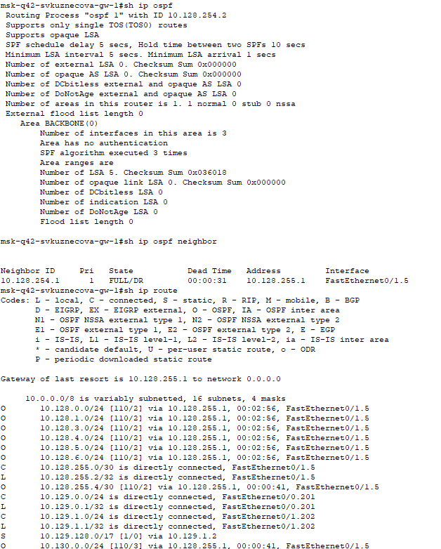

---
## Front matter
lang: ru-RU
title: Лабораторная работа №15
subtitle: Динамическая маршрутизация
author:
  - Кузнецова С. В.
institute:
  - Российский университет дружбы народов, Москва, Россия
date: 23 мая 2025

## i18n babel
babel-lang: russian
babel-otherlangs: english

## Formatting pdf
toc: false
toc-title: Содержание
slide_level: 2
aspectratio: 169
section-titles: true
theme: metropolis
header-includes:
 - \metroset{progressbar=frametitle,sectionpage=progressbar,numbering=fraction}
---

# Информация

## Докладчик

:::::::::::::: {.columns align=center}
::: {.column width="70%"}

  * Кузнецова София Вадимовна
  * Российский университет дружбы народов

:::
::: {.column width="30%"}

:::
::::::::::::::

# Ход работы

## Создание нового проекта lab_PT-15.pkt

{ #fig:001 width=80% }

## Настройка OSPF на маршрутизаторе msk-donskaya-svkuznecova-gw-1

{#fig:002 width=70%}

## Проверка состояния протокола OSPF на маршрутизаторе msk-donskaya-svkuznecova-gw-1

{#fig:003 width=35%}

## Далее приступим к настройке: маршрутизатора msk-q42-svkuznecova-gw-1, маршрутизирующего коммутатора msk-hostel-svkuznecova-gw-1, маршрутизатора sch-sochi-svkuznecova-gw-1.

{#fig:004 width=70%}

## Далее приступим к настройке: маршрутизатора msk-q42-svkuznecova-gw-1, маршрутизирующего коммутатора msk-hostel-svkuznecova-gw-1, маршрутизатора sch-sochi-svkuznecova-gw-1.

{#fig:005 width=70%}

## Далее приступим к настройке: маршрутизатора msk-q42-svkuznecova-gw-1, маршрутизирующего коммутатора msk-hostel-svkuznecova-gw-1, маршрутизатора sch-sochi-svkuznecova-gw-1.

{#fig:006 width=70%}

## Теперь проверим состояние OSPF на всех вышеперечисленных устройствах.

{#fig:007 width=35%}

## Теперь проверим состояние OSPF на всех вышеперечисленных устройствах.

{#fig:008 width=35%}

## Теперь проверим состояние OSPF на всех вышеперечисленных устройствах.

{#fig:009 width=35%}

## Перейдём к настройке линка 42-й квартал–Сочи.

{#fig:010 width=70%}

## Перейдём к настройке линка 42-й квартал–Сочи.

{#fig:011 width=70%}

## Перейдём к настройке линка 42-й квартал–Сочи.

{#fig:012 width=70%}

## Перейдём к настройке линка 42-й квартал–Сочи.

{#fig:013 width=70%}

# Выводы

В ходе выполнения лабораторной работы мы настроили динамическую маршрутизацию между территориями организации.

## {.standout}

Спасибо за внимание!
