---
## Front matter
lang: ru-RU
title: Лабораторная работа №16
subtitle: Настройка VPN
author:
  - Кузнецова С. В.
institute:
  - Российский университет дружбы народов, Москва, Россия
date: 30 мая 2025

## i18n babel
babel-lang: russian
babel-otherlangs: english

## Formatting pdf
toc: false
toc-title: Содержание
slide_level: 2
aspectratio: 169
section-titles: true
theme: metropolis
header-includes:
 - \metroset{progressbar=frametitle,sectionpage=progressbar,numbering=fraction}
---

# Информация

## Докладчик

:::::::::::::: {.columns align=center}
::: {.column width="70%"}

  * Кузнецова София Вадимовна
  * Российский университет дружбы народов

:::
::: {.column width="30%"}

:::
::::::::::::::

# Ход работы

## Создание нового проекта lab_PT-16.pkt

{ #fig:001 width=80% }

## Разместим в рабочей области проекта в соответствии с модельными предположениями оборудование для сети Университета г. Пиза.

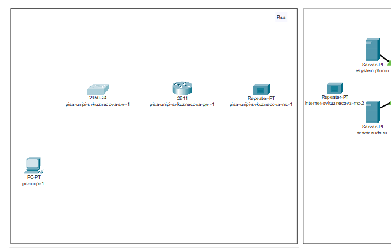{#fig:002 width=60%}

## Разместим в рабочей области проекта в соответствии с модельными предположениями оборудование для сети Университета г. Пиза.

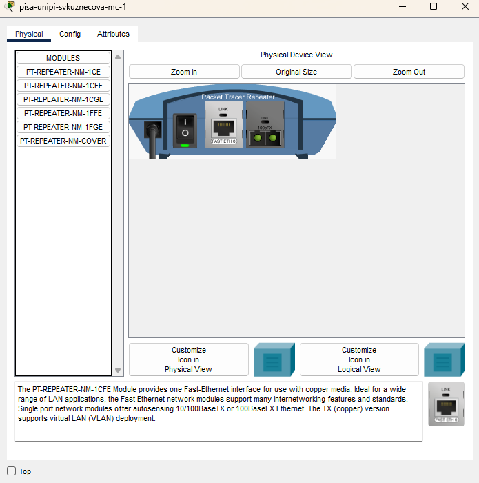{#fig:003 width=40%}

## Разместим в рабочей области проекта в соответствии с модельными предположениями оборудование для сети Университета г. Пиза.

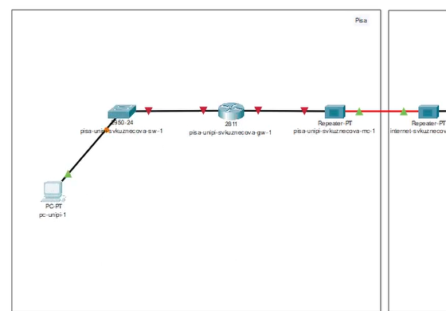{#fig:004 width=60%}

## В физической рабочей области проекта создадим город Пиза, здание Университета г. Пиза. Переместим туда соответствующее оборудование.

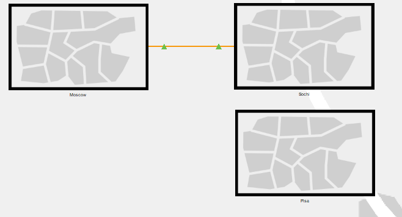{#fig:005 width=60%}

## В физической рабочей области проекта создадим город Пиза, здание Университета г. Пиза. Переместим туда соответствующее оборудование.

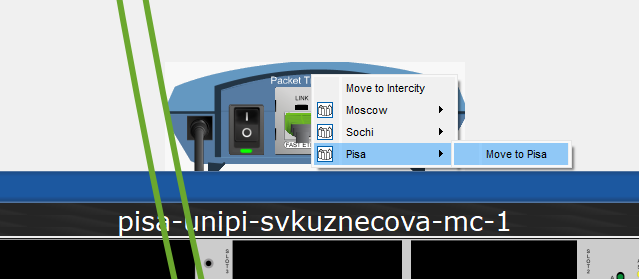{#fig:006 width=70%}

## Теперь сделаем первоначальную настройку и настройку интерфейсов оборудования сети Университета г. Пиза.

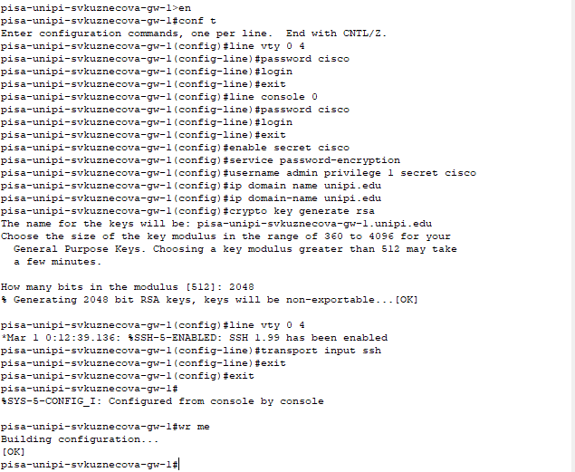{#fig:007 width=50%}

## Теперь сделаем первоначальную настройку и настройку интерфейсов оборудования сети Университета г. Пиза.

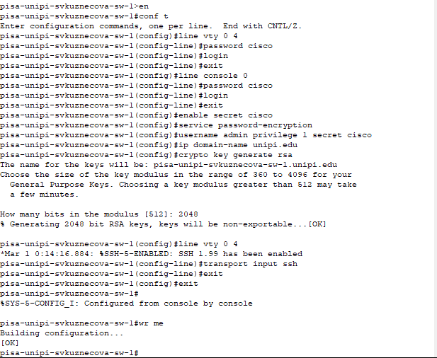{#fig:008 width=50%}

## Теперь сделаем первоначальную настройку и настройку интерфейсов оборудования сети Университета г. Пиза.

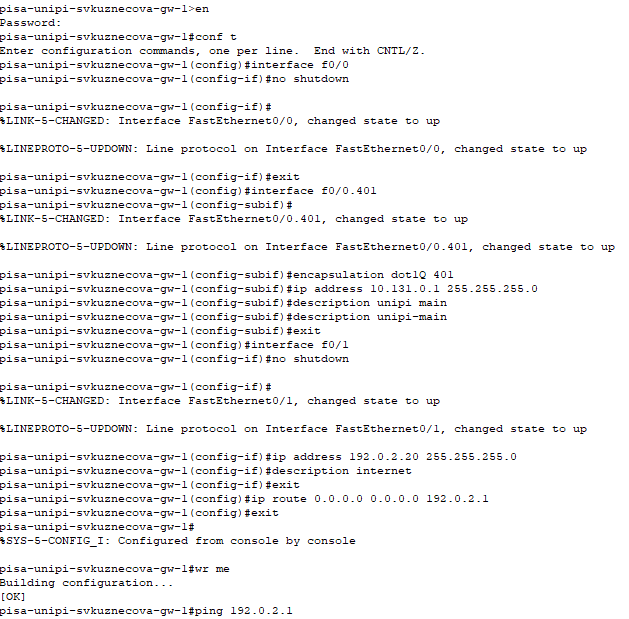{#fig:009 width=40%}

## Теперь сделаем первоначальную настройку и настройку интерфейсов оборудования сети Университета г. Пиза.

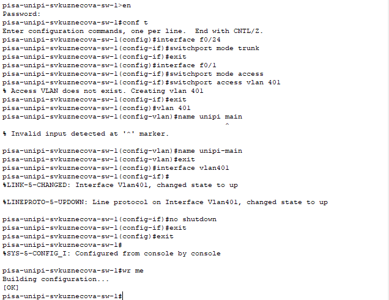{#fig:010 width=50%}

## Присвоение адресов оконечному устройству

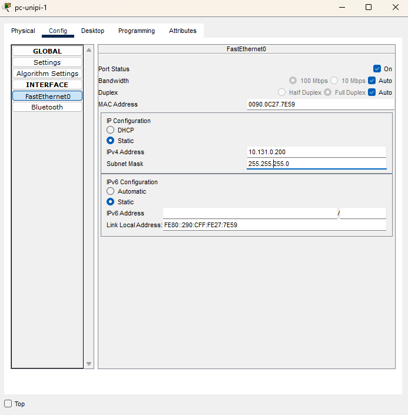{#fig:011 width=40%}

## Пинг

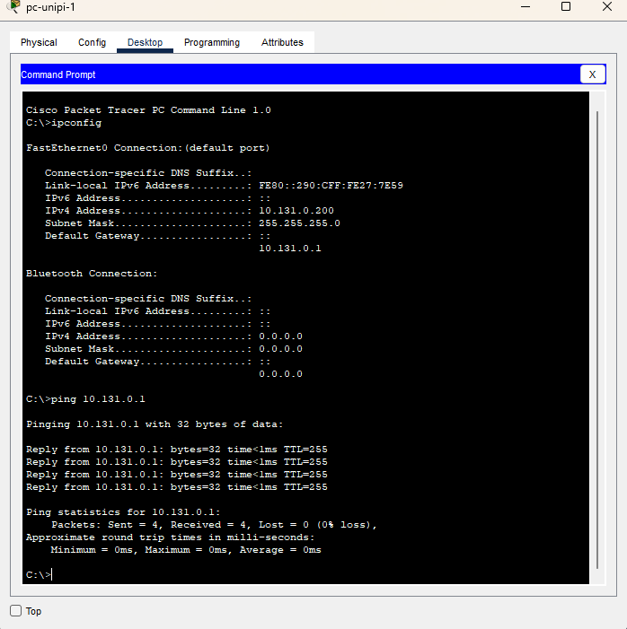{#fig:012 width=40%}

## Далее настроим VPN на основе протокола GRE.

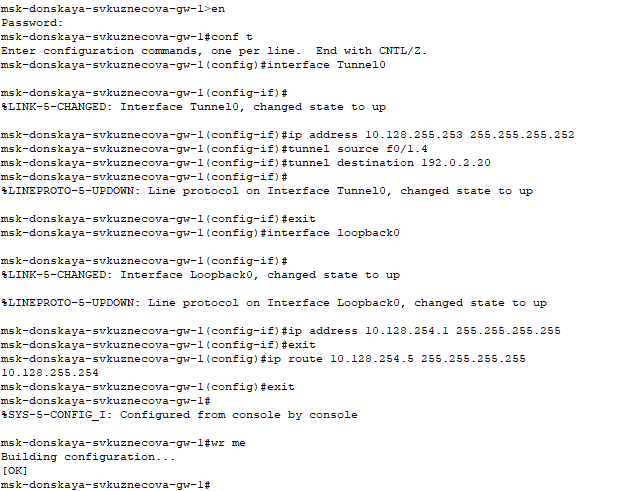{#fig:013 width=60%}

## Далее настроим VPN на основе протокола GRE.

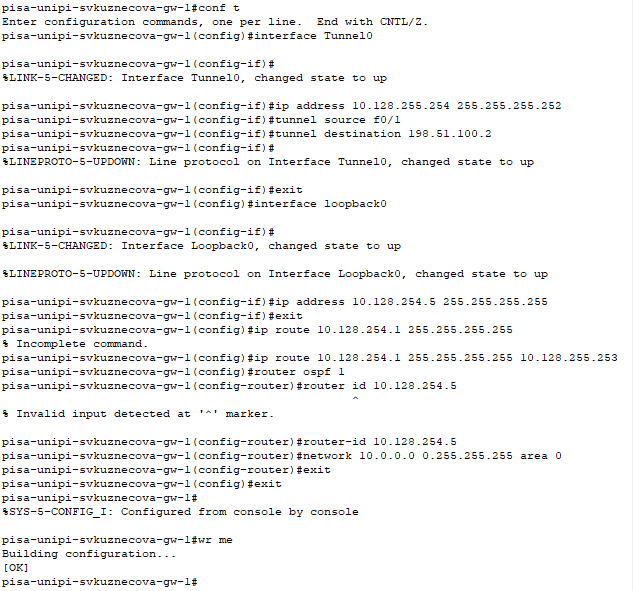{#fig:014 width=40%}

## Последним шагом проверим доступность узлов сети Университета г. Пиза с ноутбука администратора сети «Донская».

{#fig:015 width=40%}

# Выводы

В ходе выполнения лабораторной работы мы получили навыки настройки VPN-туннеля через незащищённое Интернет-соединение.

## {.standout}

Спасибо за внимание!
