---
## Front matter
title: "Отчёт по лабораторной работе №16"
subtitle: "дисциплина: Администрирование локальных сетей"
author: "Студент: Кузнецова София Вадимовна"

## Generic otions
lang: ru-RU
toc-title: "Содержание"

## Bibliography
bibliography: bib/cite.bib
csl: pandoc/csl/gost-r-7-0-5-2008-numeric.csl

## Pdf output format
toc: true # Table of contents
toc-depth: 2
lof: true # List of figures
lot: true # List of tables
fontsize: 12pt
linestretch: 1.5
papersize: a4
documentclass: scrreprt
## I18n polyglossia
polyglossia-lang:
  name: russian
  options:
	- spelling=modern
	- babelshorthands=true
polyglossia-otherlangs:
  name: english
## I18n babel
babel-lang: russian
babel-otherlangs: english
## Fonts
mainfont: IBM Plex Serif
romanfont: IBM Plex Serif
sansfont: IBM Plex Sans
monofont: IBM Plex Mono
mathfont: STIX Two Math
mainfontoptions: Ligatures=Common,Ligatures=TeX,Scale=0.94
romanfontoptions: Ligatures=Common,Ligatures=TeX,Scale=0.94
sansfontoptions: Ligatures=Common,Ligatures=TeX,Scale=MatchLowercase,Scale=0.94
monofontoptions: Scale=MatchLowercase,Scale=0.94,FakeStretch=0.9
mathfontoptions:
## Biblatex
biblatex: true
biblio-style: "gost-numeric"
biblatexoptions:
  - parentracker=true
  - backend=biber
  - hyperref=auto
  - language=auto
  - autolang=other*
  - citestyle=gost-numeric
## Pandoc-crossref LaTeX customization
figureTitle: "Рис."
tableTitle: "Таблица"
listingTitle: "Листинг"
lofTitle: "Список иллюстраций"
lotTitle: "Список таблиц"
lolTitle: "Листинги"
## Misc options
indent: true
header-includes:
  - \usepackage{indentfirst}
  - \usepackage{float} # keep figures where there are in the text
  - \floatplacement{figure}{H} # keep figures where there are in the text
---

# Цель работы

Получить навыки настройки VPN-туннеля через незащищённое Интернет-соединение.

# Выполнение лабораторной работы

Откроем проект с названием lab_PT-15.pkt и сохраним под названием lab_PT-16.pkt. После чего откроем его для дальнейшего редактирования.

{#fig:001 width=70%}

Разместим в рабочей области проекта в соответствии с модельными предположениями оборудование для сети Университета г. Пиза.

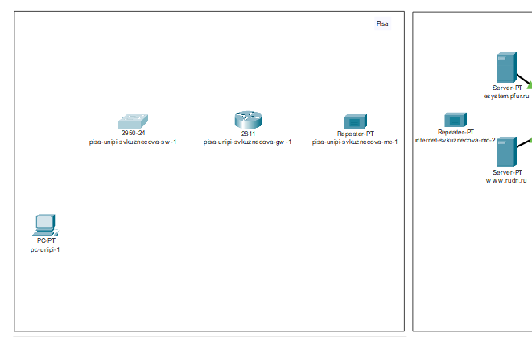{#fig:002 width=70%}

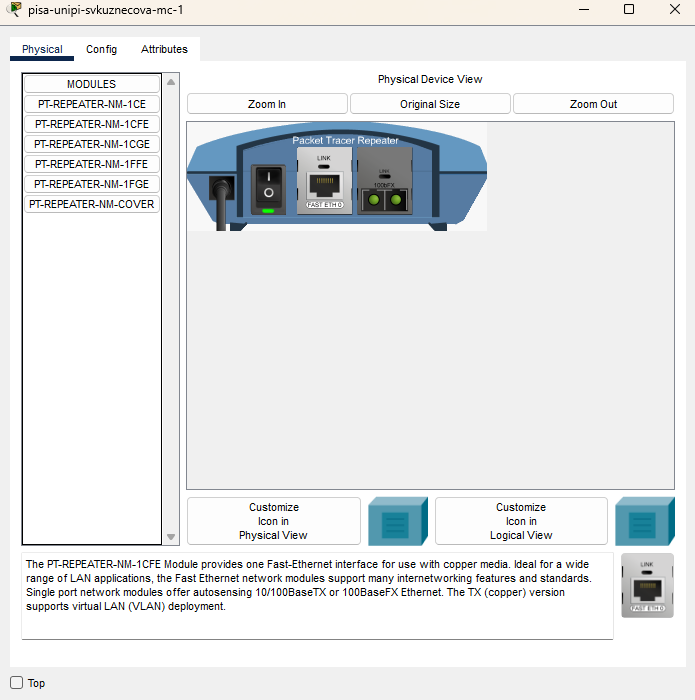{#fig:003 width=70%}

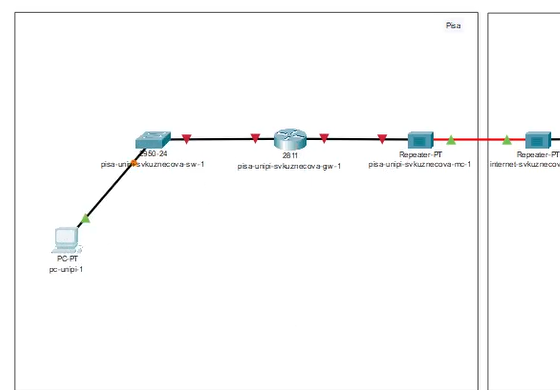{#fig:004 width=70%}

В физической рабочей области проекта создадим город Пиза, здание Университета г. Пиза. Переместим туда соответствующее оборудование.

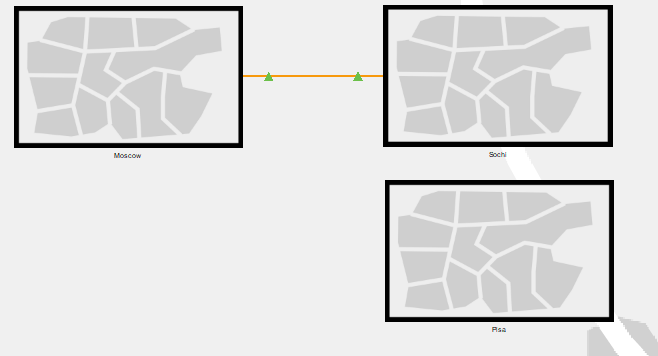{#fig:005 width=70%}

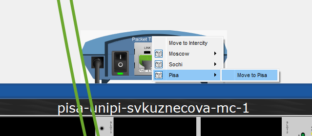{#fig:006 width=70%}

Теперь сделаем первоначальную настройку и настройку интерфейсов оборудования сети Университета г. Пиза.

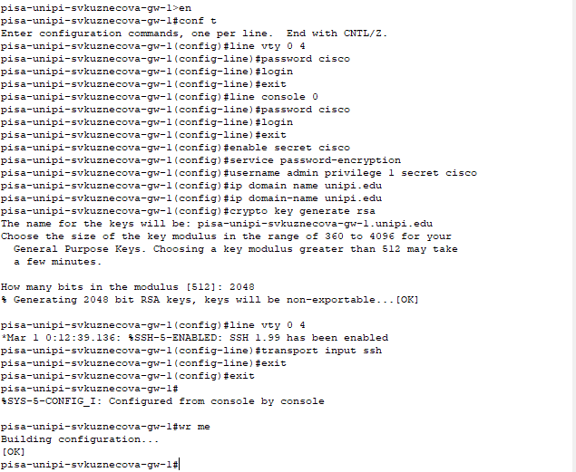{#fig:007 width=70%}

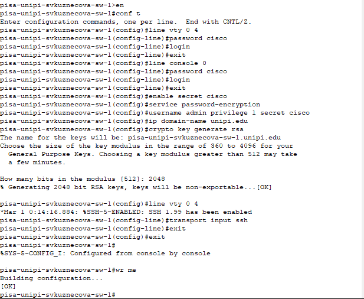{#fig:008 width=70%}

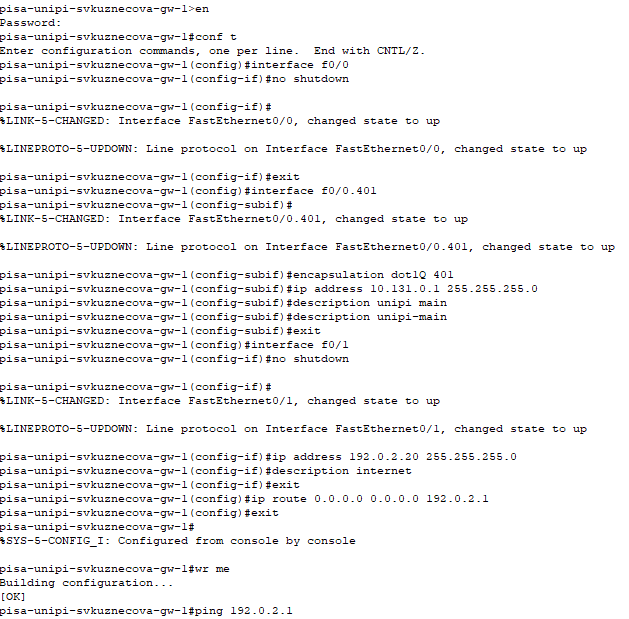{#fig:009 width=70%}

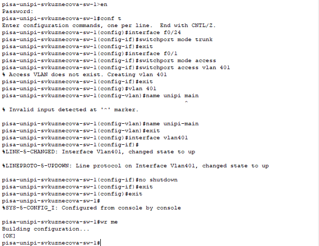{#fig:010 width=70%}

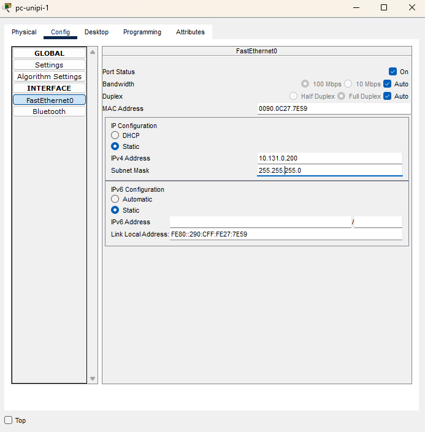{#fig:011 width=70%}

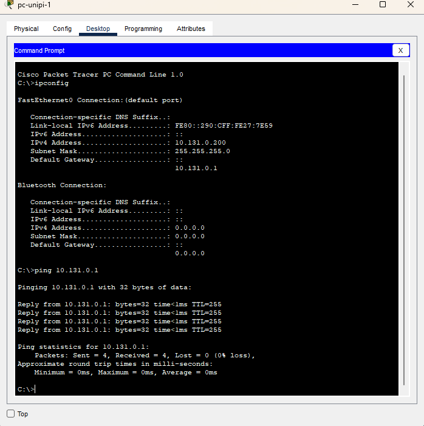{#fig:012 width=70%}

Далее настроим VPN на основе протокола GRE.

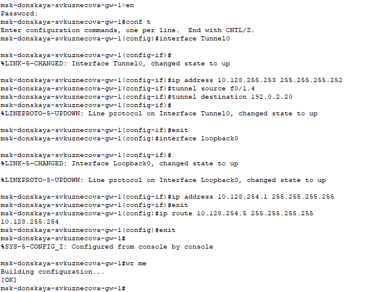{#fig:013 width=70%}

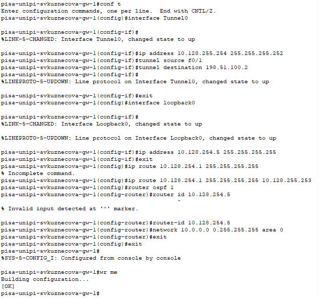{#fig:014 width=70%}

Последним шагом проверим доступность узлов сети Университета г. Пиза с ноутбука администратора сети «Донская».

{#fig:015 width=70%}

# Выводы

В ходе выполнения лабораторной работы мы получили навыки настройки VPN-туннеля через незащищённое Интернет-соединение.

# Ответы на контрольные вопросы:
1. Что такое VPN? 
- Зашифрованное соединение, устанавливаемое через Интернет между устройством и сетью.

2. В каких случаях следует использовать VPN? 
- Для дополнительного шифрования в сетях, безопасному подключению к локальным сетям извне.

3. Как с помощью VPN обойти NAT?
- Поднять VPN-туннель/подключить OpenVPN.
